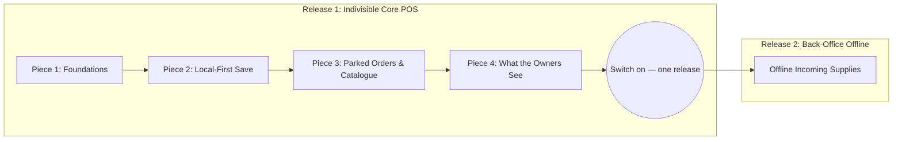

# Proposal: Leyble Hub V2.5 — Offline Accessibility & Local-First POS

**Status:** Settled (Grill completed 2026-08-23; D13–D18 added the same day). Covers all eighteen decisions. Release 1 is in build as four pieces (see §4).  
**Origin:** Alvin & Firstmate (2026-08-23).  
**Target Hardware:** **Honor Pad X8B** (11.0" Android Tablet, landscape orientation, Station 1) and secondary Android phone/tablet (Station 2).  
**Target Users:** Store owners in Antipolo, Rizal, Philippines (late 50s).  
**See also:** [PRD.md](../PRD.md), [ARCHITECTURE.md](../../architecture/ARCHITECTURE.md), [DATABASE.md](../../architecture/DATABASE.md), [glossary.md](../glossary.md), [v2-tablet-pos-overhaul.md](v2-tablet-pos-overhaul.md), [ADR 0003](../../adr/0003-device-issued-receipt-numbers.md), [ADR 0004](../../adr/0004-local-first-pos.md), [ADR 0005](../../adr/0005-offline-scope-by-operation.md), [ADR 0006](../../adr/0006-receipt-number-as-idempotency-key.md), [ADR 0007](../../adr/0007-native-storage-for-device-state.md), [ADR 0008](../../adr/0008-release-switch-for-the-offline-core.md).

---

## 1. Executive Summary & Operating Reality

### Operating Reality in Antipolo
Leyble General Merchandise operates in Antipolo, Philippines, where the physical store faces infrastructure realities that dictate software requirements:

1. **Frequent Network Outages:** Internet connectivity drops roughly **weekly**, for a random duration ranging from **hours to days at worst**.
2. **Current Failure Mode:** Leyble Hub V1 and V2.0 are entirely cloud-dependent. When an outage occurs, the app becomes unusable. Store owners currently fall back to a physical, pre-numbered paper receipt booklet.
3. **Prevalence of Hand-Written Paper Receipts:** Even during normal online operations, **approximately 25% of daily transactions are hand-written on paper** and never entered into Leyble Hub. Physical booklet numbering operates independently and will not collide with app receipt numbering (accepted by the product owner).
4. **Stock Accuracy is Approximate by Design:** Because ~25% of sales bypass the app entirely on paper, inventory stock figures in the database are already approximate by business reality. Therefore, offline software must **never introduce complex blocking machinery to defend theoretical stock precision** (e.g. no offline stock locking, no negative-stock transaction blocks).
5. **Two Concurrent Devices:** The store uses two devices to create sales: the primary counter tablet (**Honor Pad X8B**) and a secondary tablet/phone. Simultaneous order creation across both devices is possible.
6. **Authentication Token Persistence:** The JWT authentication token has **no expiry set in code** (`JWT_EXPIRES_IN` remains unset). Consequently, multi-day outages do not log devices out. *(Constraint: `JWT_EXPIRES_IN` must remain unset in production, or the offline architecture must explicitly handle token expiration).*

### Core Objective
Transform Leyble Hub POS into a **local-first system** where counter operations (creating orders, quick-creating customers, capturing custom prices, and printing thermal receipts) operate with 100% speed and reliability in all network states: online, offline, or experiencing high-latency network timeouts.

```mermaid
graph TD
    subgraph Counter POS Workflow (Local-First Always)
        A[Create Order / Quick Customer] --> B[Save Order to Native Device Storage]
        B --> C[Assign Device Receipt Number e.g. 1-00042]
        C --> D[Print 80mm 2-Copy Thermal Receipt Instantly]
        B --> E[Enqueue Record in Local Outbox]
    end

    subgraph Background Sync Worker
        E --> F{Network Available?}
        F -- Yes --> G[Drain Outbox via FIFO Dependency Order]
        G --> H[Cloud API: POST /api/v1/orders<br/>keyed by receipt number]
        H --> I[PostgreSQL on Supabase]
        F -- No --> J[Keep in Outbox: Show Marker 'Offline · N waiting']
        H -- Rejected / Conflict --> K[Move to 'Needs Attention' Queue]
    end
```

---

## 2. Locked Business Rules & Architecture (D1 – D18)

### D1 — Receipt Number is Decoupled from the Database Row ID [SETTLED]
* **Per-Device Station Number Spaces:** `receipt_number` becomes a first-class domain concept issued locally by the device at the moment of Save, executing the exact same code path online and offline.
* **Format:** `<station>-<sequence>`, e.g., `1-00042`, `2-00042`.
* **Row ID Stays Internal:** PostgreSQL `orders.id` integer primary key remains an internal database identifier. The user interface, order history, and thermal receipts display `receipt_number` everywhere `#<id>` was previously shown.
* **One-Time Station Registration:** A device registers with the cloud server once upon initial app installation (`POST /api/v1/stations/register`), receives the next sequential station number (1, 2, ...), and permanently stores it in native storage (`@capacitor/preferences`). Scales to N devices.
* **Station Numbering Invariant:** A wiped or reinstalled device receives a NEW station number upon re-registration, never reclaiming its old station number. Station numbers only creep upward.
* **Existing Orders Backlog:** Approximately 1,300 pre-existing orders retain their plain numeric sequence IDs without a station prefix. This one-time step in numbering is accepted.
* **Offline Installation Edge Case:** A brand-new device installed during an active outage cannot issue receipts until it connects to the internet once to register. Store paper receipt booklets cover this corner case.
* **See also:** [ADR 0003](../../adr/0003-device-issued-receipt-numbers.md).

### D2 — The POS is Local-First, Always [SETTLED]
* **Local-First in Every Case:** Every order creation, customer quick-create, and price capture writes immediately to the app's native device storage before touching the network (see D17 for why not the WebView's).
* **Offline is an Outbox, Not a Mode:** Offline is not a separate application toggle or fallback code path — it is simply an outbox that has not yet drained.
* **Single Code Path:** Online and offline transactions run the exact same code path every day. This eliminates untested "outage-only" fallback branches and avoids the ambiguity of degraded, hanging network connections.
* **See also:** [ADR 0004](../../adr/0004-local-first-pos.md).

### D3 — Offline Scope is Decided by OPERATION, Not by Module [SETTLED]
Scope is determined strictly by the mathematical nature of the operation rather than UI module boundaries:

| Category | Operations | Handling |
| :--- | :--- | :--- |
| **Works Offline**<br>*(Additive Creates of Self-Contained Records)* | • Build, save, and print POS receipt (`POST /orders`)<br>• Quick-create customer mid-order (`POST /customers`)<br>• Capture customer custom price (`POST /customers/:id/prices`)<br>• Record incoming supplier delivery (`POST /incoming`)<br>• Park an order draft<br>• Reprint receipts from local 30-day cache | Allowed offline. Records are saved to native device storage and queued in the outbox. Concurrent entries across devices merge cleanly upon sync. |
| **Requires Online Connection**<br>*(Reversals & Overwrites of Shared State)* | • Cancelling a synced order (restores stock)<br>• Voiding a supplier delivery (reverses restock)<br>• Editing an order or delivery that has already synced<br>• Manual stock adjustments and batch price edits | Blocked offline with an explicit online-required message. *(Note: Unsynced local drafts or outbox orders that have not yet left the device may be freely edited or discarded locally).* |

* **See also:** [ADR 0005](../../adr/0005-offline-scope-by-operation.md).

### D4 — Duplicates Land; They are Surfaced, Never Auto-Merged [SETTLED]
When two disconnected devices create customers with identical or similar names offline, both records land in the database upon reconnection. The system surfaces duplicates using the **4 + 3 + 2 combination** (approved via Lavish review):
1. **Tells Them (4):** One non-blocking toast upon outbox drain completion: *"14 receipts synced · 2 customers may be duplicates"*. Fires once per outage recovery, never repeated.
2. **Waits for Them (3):** A clearable count badge on the Customers navigation tab, using the same design language as the POS Drafts/History badges.
3. **Fixes It (2):** A `"possible duplicate"` chip on the customer row in the Customers directory, opening the existing customer merge flow pre-filled. Uses `customerSearch.js` punctuation-insensitive normalization to identify potential duplicate names.
4. **No Auto-Merging:** The system never automatically merges customer accounts based on name matching, as multiple distinct customers in the community may share identical names.

### D5 — Device Clock is Trusted; Paper is the Truth [SETTLED]
* **Device Timestamp at Sale Time:** The receipt's date and time are generated from the device clock at the exact moment of sale (`created_at` passed explicitly in the payload).
* **Why:** If the server assigned insert time on sync, sales made during a Tuesday outage would be recorded on Thursday upon sync, breaking today-scoped History filters, daily sales reporting, and the NOT PRINTED badge, and causing reprinted receipts to contradict the physical paper in customer hands.
* **Precedent:** Follows the existing codebase precedent where `supplier_deliveries.received_at` is passed explicitly from the client.
* **Zero Clock-Policing:** The system assumes tablet clocks synchronize automatically. If clock drift occurs, it is accepted; no clock-skew detection, warning dialogs, or transaction blocking will be built.
* **Pricing & Ordering Rule:** Prices sync exactly as printed per line (`unit_price` per line is already accepted by the server). Locally created customers are sequenced in the outbox to sync before any orders referencing them.

### D6 — Parked Orders Stay Shared Across Devices with Offline Fallback [SETTLED]
* **Online Behavior (Unchanged):** Parked drafts sync to the cloud server and remain visible and resumable across both devices.
* **Offline Degradation:** During an outage, parked orders degrade quietly to device-local storage. A parked draft created offline stays on that tablet until the connection returns.
* **Accepted Double-Print Risk:** Tablet A parks an order → Tablet B picks it up online and prints it → connection drops while Tablet A still holds its stale local draft → Tablet A resumes and prints it offline. The customer receives two receipts with two distinct receipt numbers.
* **Handling:** No distributed locks or blocking guards are built. When connectivity restores and both orders sync, the system flags the matching items as a potential double order using the D4 duplicate surfacing pattern.

### D7 — Outbox Status Marker: Standing Connection Marker [SETTLED]
> **Revision Note (2026-08-24 / 2026-08-25):** The original "Zero Normal Wallpaper" specification below was superseded in implementation on 2026-08-24 in `client/src/components/layout/OfflineMarker.jsx` (whose header comment records the revision). The written rule was not updated at the time. On 2026-08-25, the product owner confirmed that the shipped always-visible marker is correct and that the document should follow the code. No rationale was recorded for the revision at the time.

* **Standing Top-Bar Marker:** A status badge is permanently mounted in the navigation bar to provide unambiguous connection and outbox awareness:
  - **Online & Idle (0 waiting):** Calm green `● Online` indicator (no alarm, no red).
  - **Online & Syncing:** Sky-blue `● N waiting` indicator while outbox drains.
  - **Offline & Idle (0 waiting):** Amber `● Offline` indicator.
  - **Offline & Queued:** Amber `● Offline · N waiting` indicator.
  - **Refused Receipts:** Pulsing red `● Needs attention` / `● N waiting` badge that opens the attention resolution dialog (D8).
* **Accidental Loss Prevention:** Making the waiting outbox count visible ensures operators do not clear app data, drop, or wipe a device that holds unsynced sales.

```
[ Normal Online / Idle ]  ──►  [ 🟢 Online ]
[ Outage Active        ]  ──►  [ ⚠️ Offline · 14 waiting ]
[ Online Syncing       ]  ──►  [ 🔄 14 waiting ]  ──►  [ 🟢 Online ]
[ Refused Receipts     ]  ──►  [ 🚨 Needs attention ] (Clickable modal)
```

### D8 — Refused Receipts Go to an Attention List, Never a Guess [SETTLED]
* **Attention List Queue:** If the cloud server rejects an outbox receipt during sync (e.g. because a referenced customer was merged or deactivated on another device during the outage), the receipt is **never discarded** and **never auto-reassigned**.
* **Operator Resolution:** The receipt is moved to a "Needs Attention" queue with a plain-language explanation (e.g., *"Customer Aling Nena was merged into Nena Santos — select destination customer"*). The store owner points the receipt to the correct record in two taps.
* **Rationale:** The physical receipt is already in the customer's hands; silent dropping or guessing customer identity corrupts financial and operational truth.

### D9 — 30-Day Rolling Local History Cache [SETTLED]
* Each device maintains a rolling 30-day cache of past receipts and catalogue records in native device storage (D17).
* The local cache is silently updated in the background whenever the device is online, enabling instant search and receipt reprinting during outages without bloating storage.

### D10 — Zero Rehearsal for Store Owners [SETTLED]
* **No User Outage Drills:** Store owners (in their late 50s) will not be asked to rehearse or execute outage drills.
* **Build-Side Verification:** All offline testing, outbox drain verification, and conflict recovery are validated build-side prior to release.
* **Internal Test Toggle:** A simulated offline mode toggle is included strictly as a developer/QA testing tool and is never exposed in the user-facing store interface.

### D11 — Active Disconnect Advisory Toast [SETTLED]
* **Trigger:** When a user actively saves an order and the network call fails for the first time during an outage, a one-time advisory toast notification appears based on registered station number:
  * **Station 1 (Main Counter Tablet / Honor Pad X8B):** *"You are offline. Keep working here, and leave the other device alone until the connection returns."*
  * **Station 2 (Secondary Tablet / Phone):** *"You are offline. Use the main tablet if you can."*
* **Advice, Not a Lockout:** The second device is **not locked out** from creating orders offline. If the main tablet runs out of battery, is on a delivery truck, or is in use, the second device remains fully capable of completing sales.

### D12 — Two-Release Delivery Shape [SETTLED]
The implementation is partitioned into two distinct releases:
1. **Release 1 (Indivisible Core POS):** Local-first POS, device-issued receipt numbers, waiting receipts outbox sync engine, shared-to-local parked drafts, duplicate surfacing, attention list, top-bar status marker, and advisory toasts.
   * *Rationale:* These components form an indivisible core. An offline POS without unique receipt numbers or draft reliability is worse than the current app.
2. **Release 2 (Offline Incoming Supplies):** Offline recording of incoming supplier deliveries (`POST /api/v1/incoming`). Follows immediately after Release 1.

### D13 — The Receipt Number is Also the Anti-Duplicate Key [SETTLED]
The device-issued receipt number (D1) is not only what the customer reads off the paper. It is the **identity of the record**, and therefore the protection against a resend becoming a second sale.

* **The Problem It Solves:** `POST /api/v1/orders` inserts a new orders row unconditionally, and nothing in the request identifies a retry. A send that commits on the server and then times out on the way back — a state D2 names explicitly as real — becomes a duplicate order the moment the outbox tries again.
* **The Number Travels With Every Queued Record:** The outbox sends the receipt number with each record it drains, and the server stores it decomposed as `orders.receipt_station` / `orders.receipt_sequence`, with the display form `1-00042` as a `GENERATED` column.
* **Unique on Station + Sequence:** A partial unique index over rows that actually carry a receipt number. It is partial rather than plain so that uniqueness is stated to apply to *issued* numbers only, leaving the ~1,300 historical rows out of the index entirely.
* **A Second Arrival is a SUCCESS, Not an Error:** A receipt number already stored is answered with the stored order and `200 OK` — never `409`, never a second row. The device needs a success in order to clear the record from its outbox and stop retrying; an error would leave it stuck forever, retrying an order the server already has.
* **Reusable by Every Retryable Record Type:** Parked orders are `orders` rows and are covered by the same key. Release 2's incoming deliveries adopt it by adding the same column pair and index to `supplier_deliveries` and registering the table in `server/src/lib/idempotency.js`.
* **Invisible When It Works:** No new concept for the owners. They never see it succeed and never see it fire.
* **See also:** [ADR 0006](../../adr/0006-receipt-number-as-idempotency-key.md).

### D14 — Each Queued Record Carries the Profile That Made It [SETTLED]
* **The Problem It Solves:** The app sends the active profile as the `X-Active-Profile` header on every request, and `server/src/middleware/auth.js` swaps the JWT identity for that profile's user id **at request time**. Everything downstream — `activity_logs.performed_by`, stock movement attribution, receipt-printed-by — is taken from that header. Left alone, a drained outbox files every offline receipt under whoever happens to be holding the tablet when the connection returns: Josie credited with Luis's entire Tuesday, in the activity log and in the stock movements alike.
* **Rule:** The profile is captured **on the device at the moment of Save** and stored with the queued record. When the outbox drains, it sends that stored profile per record, not the currently active one.
* **Applies To:** Receipts, parked orders, receipt-printed marks, quick-created customers, and Release 2's deliveries. A record cannot be queued without a profile — there is no sensible default, since the only available fallback is the exact bug the rule exists to prevent.
* **No Server Change Required:** The header already does the identity swap. The change is that the outbox sets it per record rather than per session.

### D15 — A Lost Connection May Never Log the Tablet Out [SETTLED]
* **The Problem It Solves:** `client/src/api/client.js` treats **any** 401 by clearing the stored token and active profile and hard-redirecting to `/login`, and logging back in requires the server. An authentication hiccup while the outbox holds unsent receipts would lock the owners out of an app that is holding their sales, with no way back in until the line returns.
* **A Network Failure is Not a 401:** Only a real 401 response from the server counts. A timeout, a dropped connection or a DNS failure never reached the server and must never be read as a rejected session.
* **Device State Outlives the Session:** Waiting receipts, the local receipt history and the device's station number **survive logout and re-login**. They belong to the tablet, not to whoever is signed in. Concretely: every one of them lives under the `v25.` native-storage prefix, and the logout path clears `authToken` and `activeProfile` **by name** — it must never become a prefix sweep.
* **The Login Screen Says So:** When the device holds unsent receipts, the login screen says as much rather than looking like an empty app.
* **Standing Constraint:** `JWT_EXPIRES_IN` remains unset.

### D16 — The Tablet Sells Only What It Already Holds [SETTLED]
* **Quiet Refresh, No Announcement:** The whole catalogue — products, prices, customers — refreshes silently whenever the tablet is online. No staleness warning, no "last updated" age indicator, nothing shown.
* **A Product Added While Blind Cannot Be Sold:** Until the line returns, the tablet sells from the copy it holds. Accepted by the product owner.
* **Prices Print as Held:** The paper is the truth — the same principle as D5. The server already accepts the printed `unit_price` per line rather than recomputing from the catalogue.
* **An Invisible Customer Gets Quick-Created Twice:** A customer added on the other tablet during an outage is invisible to this one, so she is created a second time. That is D4's duplicate surfacing doing its job, and is the accepted outcome rather than a defect.

### D17 — Waiting Receipts Live in the App's Native Storage [SETTLED]
* **Never WebView Storage:** The outbox, the station number and sequence, and the 30-day local receipt history (D9) must **not** live in `localStorage` or IndexedDB. Android evicts WebView storage under pressure, and a routine "clear data" tap wipes it — which is exactly the silent loss of unsent sales that D7's marker exists to make visible.
* **Chosen Mechanism: `@capacitor/preferences`, one key per record.** The same native, app-sandboxed store the auth token already uses (Android `SharedPreferences` underneath). What makes it hold 30 days of receipts rather than buckle under them is the **layout**: one key per record, never one growing JSON blob.
  * A blob would be re-serialised and rewritten on every save, and a write interrupted mid-receipt would tear the whole history. A key per record writes only the record that changed, and a torn write can cost at most that one record.
  * Keys are enumerable, and outbox and history keys embed a zero-padded monotonic id, so a plain lexicographic sort of the keys **is** insertion order. That removes the need for a separate index — the one thing in a key-value store that can drift out of step with the records it points at.
  * Sizing: at this shop's volume, 30 days is on the order of a thousand receipts of a couple of KB each — low single-digit MB across a thousand-odd keys, well inside what `SharedPreferences` handles.
  * The alternative, `@capacitor-community/sqlite`, was not adopted: it adds a native plugin and a build step to solve a problem the per-key layout already solves. If the local history ever outgrows key-value, **that** is the answer — never a fall back to WebView storage. `client/src/offline/nativeStore.js` is the seam for that swap: everything above it speaks only get / set / remove / keys.
* **Key Layout:** everything sits under a single `v25.` prefix, which is what makes D15's "survives logout" auditable at a glance.
* **Local Browser Dev:** `npm run dev` has no native store, and D17 forbids reaching for the WebView one, so dev falls back to an **in-memory** map. The machinery runs and can be exercised, but nothing survives a page reload. That is a deliberate dev-only limitation, not a storage tier — production is the APK.
* **See also:** [ADR 0007](../../adr/0007-native-storage-for-device-state.md).

### D18 — Built in Pieces, Released as One [SETTLED]
Refines D12 without changing it: D12's core remains one indivisible **release**, but it does not have to be one pull request.

* **Four Reviewable Pieces, One Release:** The core lands as four separately reviewable pull requests, each dark on arrival, all switched on together as the single release D12 requires.
* **One Switch, Reused by Every Piece:** `client/src/config/features.js` exports `V25_OFFLINE_CORE`, read once at module load from the build environment (`VITE_V25_OFFLINE_CORE=on`). Off by default, and with it off no piece of the core may change what the app does.
* **Why Build-Time Rather Than a Setting:** The switch has to be readable when the device is blind, so it cannot depend on the server; and a switch that could flip mid-session could make a half-drained outbox appear or vanish under the owners' hands, which is the one thing D7 exists to prevent. A release is a new APK either way, so a build-time flag costs nothing.
* **The Database is Not Behind the Switch:** Migrations run at deploy time regardless. Every migration in this release is therefore additive and correct standing alone, with the switch off and no client yet issuing receipt numbers.
* **The Server is Dark by Data, Not by Flag:** The API's new behaviour is reachable only when a request actually carries a `receipt_number` or a device `created_at`, which only a switched-on client sends. There is no server-side flag to keep in step with the client's.
* **See also:** [ADR 0008](../../adr/0008-release-switch-for-the-offline-core.md).

---

## 3. Explicit Non-Goals

To maintain design integrity and prevent over-engineering, the following items are explicitly out of scope:

1. **Defending Stock Accuracy Offline:** No offline stock reservations, warning dialogs for zero/negative stock, or stock locking mechanisms.
2. **Clock-Skew Policing:** No NTP synchronization checks, clock-drift warning modals, or transaction blocking based on device timestamps.
3. **Automatic Duplicate Merging:** No automatic merging of customer profiles based on name similarity.
4. **Distributed Database Engine / CRDTs:** No multi-master distributed consensus protocol.
5. **Hard Station Lockouts:** No hard software barrier preventing Station 2 from creating orders while offline.
6. **User Outage Drills:** No operational rehearsal requirements for store owners.
7. **Dual-Path POS Branches:** No separate "offline mode" UI or distinct fallback execution path.
8. **Server-Issued Number Pre-Allocation:** No server-allocated sequential receipt number blocks.
9. **WebView Storage of Any Kind:** No `localStorage`, no IndexedDB, no Cache Storage for device state (D17). Not as a primary store, and not as a fallback.
10. **Catalogue Staleness Surfacing:** No "last updated" age indicator, no stale-data warning, no refusal to sell from a held catalogue (D16).
11. **Logging Out on a Network Failure:** No treating a timeout, a dropped connection or a DNS failure as an expired session (D15).
12. **Backfilling Historical Receipt Numbers:** The ~1,300 pre-existing orders are never assigned station-prefixed numbers (D1).
13. **Refusing a Retry:** A resent receipt number is never answered with an error or a conflict status — a device that cannot get a success can never clear its outbox (D13).

---

## 4. Delivery Shape — Four Pieces, One Release (D18)

Release 1 is one release and four pull requests. Each piece lands **dark** behind
`V25_OFFLINE_CORE` (D18) and is reviewed on its own; the switch is turned on once, when
all four are in.



| Piece | Scope |
| :--- | :--- |
| **Piece 1 — Foundations** | Station registration (`POST /api/v1/stations/register`) and device-issued receipt numbers (D1); the native local store and the outbox skeleton with its drain (D17, D5 ordering); the server's unique receipt number and idempotent resend (D13); per-record profile capture (D14); device-supplied sale time (D5); the release switch itself (D18); the display migration from `#<id>` to the receipt number. |
| **Piece 2 — Local-First Save** | The POS save path writing locally first and printing without waiting (D2); the 30-day local receipt history and reprint (D9); the queued not-printed mark. |
| **Piece 3 — Parked Orders & Catalogue** | Parked orders staying shared while online and degrading quietly while blind (D6); the quiet catalogue refresh (D16). |
| **Piece 4 — What the Owners See** | The top-bar offline marker (D7); the advisory toast (D11); duplicate surfacing (D4); the attention list (D8); the API client's 401-versus-network-failure fix (D15). |
| **Release 2** | Offline incoming supplier deliveries (`POST /api/v1/incoming`), adopting piece 1's idempotency mechanism. |

---

## 5. Technical Design & Data Flow

### Local Storage — `@capacitor/preferences`, One Key Per Record (D17)

Device state lives in the app's own native, app-sandboxed store — the same one the auth
token already uses. **Not** `localStorage`, **not** IndexedDB: Android evicts WebView
storage under pressure and a routine "clear data" tap wipes it, which is exactly the
silent loss of unsent sales this release exists to prevent. See D17 above for the full
justification, including why the per-key layout is what makes key-value adequate for 30
days of receipts, and what would be adopted instead if it ever stopped being adequate.

Everything sits under one prefix, `v25.`, which is what makes D15's *survives logout*
requirement auditable at a glance — the logout path clears `authToken` and
`activeProfile` **by name** and never sweeps a prefix.

```
v25.station                 # { device_key, station_number, registered_at }   — D1
v25.sequence                # last receipt sequence issued on this device     — D1
v25.outbox.nextId           # monotonic record id
v25.outbox.<paddedId>       # one queued record per key, sorted = FIFO        — D2/D5
v25.ref.<outboxId>          # a synced dependency's real server id            — D5
v25.receipt.<receiptNumber> # one locally held receipt per key, 30 days       — D9
```

| Module | Responsibility |
| :--- | :--- |
| `client/src/offline/nativeStore.js` | The only place that talks to `@capacitor/preferences`. The seam a future SQLite backend would replace. |
| `client/src/offline/keys.js` | The key layout above, in one place. |
| `client/src/offline/station.js` | One-time registration; serialised receipt-number issuance. |
| `client/src/offline/outbox.js` | Enqueue, ordering, dependency references, drain. |
| `client/src/offline/receiptHistory.js` | The 30-day local history and its pruning. |
| `client/src/config/features.js` | The release switch (D18) and the build-side offline simulation switch (D10). |

### Receipt Number Issuance (D1)

`issueReceiptNumber()` reads the station number, increments the stored sequence, and
returns `<station>-<sequence>` — no server round trip, online or offline, same code path
every day. Two properties matter:

* **The sequence is persisted before the number is handed out.** A crash can therefore
  skip a number but never repeat one. A gap is invisible; a repeat is two customers
  holding the same receipt number.
* **Issuance is serialised.** The read-increment-write straddles two `await`s, so two
  Saves in flight at once would otherwise read the same value.

A device with no station number cannot issue receipts at all. That is the accepted
corner from D1 — a brand-new device installed mid-outage is covered by paper.

### Outbox Drain Protocol

1. **Enqueue.** A saved record is written to its own key with the profile active at Save
   (D14 — a record cannot be queued without one), the receipt number it was issued (D13),
   and the ids of any records it depends on.
2. **Order.** Records drain oldest first. A locally created customer is enqueued before
   any order referencing her, and the order's payload carries a `{ $ref }` placeholder
   in place of the id it cannot know yet (D5). When the customer syncs, her real id is
   remembered under `v25.ref.<outboxId>` and the placeholder resolves. An order whose
   customer has not synced is skipped, not sent without her — but unrelated receipts
   behind it still go.
3. **Send.** `X-Active-Profile` is set from the record, not from the session.
4. **Outcomes.**

| Response | Handling |
| :--- | :--- |
| Any 2xx | Done. Removed from the outbox. A `200` replay of an already-stored receipt number counts exactly as much as a `201` (D13). |
| Network failure / timeout | Never reached the server. The record stays queued untouched and the pass stops — there is no point trying the next record down a dead line. Never read as an authentication failure (D15). |
| 5xx | Same as a network failure. |
| Other 4xx | Moved to the attention list with the server's reason (D8). Never discarded, never guessed at. |

### Server-Side Schema and Routes

| Change | Detail |
| :--- | :--- |
| `stations` table (migration 033) | `device_key` (unique, device-generated — the idempotency key for registration), `station_number` from a `SEQUENCE` so numbers never repeat and never come back down. |
| `POST /api/v1/stations/register` | Idempotent on `device_key`: a retried registration returns the same station rather than burning a second number. A wiped device registers with a fresh key and gets a new number. |
| `orders.receipt_station` / `receipt_sequence` (migration 033) | Nullable, additive. A `CHECK` keeps the pair whole, and a **partial** unique index over rows that carry a number enforces D13 while leaving the ~1,300 historical rows out of the index. |
| `orders.receipt_number` | `GENERATED ALWAYS AS ... STORED` — the display form can never drift from the pair it derives from, the same treatment `order_items.line_total` already gets. |
| `POST /api/v1/orders` | Accepts optional `receipt_number` and `created_at`. Both absent = today's behaviour, unchanged. A `receipt_number` already stored is answered with the stored order and `200`. |
| `server/src/lib/idempotency.js` | The resend rule, table-agnostic. Release 2 adopts it for `supplier_deliveries` by adding the same column pair and index and registering the table. |

The API is dark by **data**, not by flag: its new behaviour is reachable only when a
request actually carries a receipt number or a device `created_at`, which only a
switched-on client sends.

---

## 6. Execution & Verification Protocol

* **Automated Test Coverage:**
  * Local receipt number issuance: format, sequencing, no repeat under concurrent Saves,
    persisted before handed out, refused on an unregistered device.
  * Station registration: a second device gets a different number, a retry gets the same
    one, a wiped device gets a new one rather than its old one.
  * The server's duplicate receipt number path: exactly one order row, a success response
    both times, no second stock deduction, and the same protection on a parked order.
  * Per-record profile attribution through a drain: `activity_logs.performed_by` and the
    stock movement follow the profile stored with the record, not the one active at drain
    time.
  * Device-supplied sale time honoured; omitting it keeps the server clock.
  * Outbox ordering: a customer before her order, a `$ref` resolving to the real id, an
    order held back when its customer has not synced.
  * Storage: device state survives a logout, sits entirely under `v25.`, and touches
    neither `localStorage` nor IndexedDB.
  * The release switch defaults off, and with it off an order still reads as `#<id>`.
  * Duplicate customer detection and normalisation (piece 4).
  * Attention list routing on a simulated 4xx rejection.
* **Migration Verification (no staging environment exists):** every migration is applied
  against a clone of the production schema **with representative data** before the PR is
  opened, and the PR description records exactly how. Checked each time: existing rows
  untouched, the previously deployed server's `INSERT`/`SELECT` statements still correct
  against the new schema, and each new constraint demonstrated to fire.
* **Build-Side Verification (D10 — the owners rehearse nothing):**
  * Tested on the Honor Pad X8B and on mobile viewports.
  * The deliberate offline switch (`VITE_V25_SIMULATE_OFFLINE=on`, or
    `window.__leyble.simulateOffline(true)` in a dev build) exercises the local-first path
    and the reconnect drain without unplugging anything. It is a build-side tool with no
    UI and is never a surface the owners are pointed at.

---

## 7. Deployment Note — Owned by the Product Owner

**Both tablets must be online the first time they open the updated app**, so each can
claim its station number (D1). Roll the release out on an ordinary day, never during an
outage.
