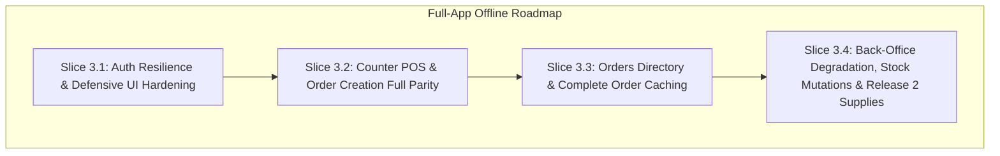

# Proposal: Leyble Hub V2.5 — Full-App Offline Accessibility & Local-First Architecture

**Status:** Settled Specification (Updated 2026-08-28 following the Full-App Offline Accessibility Audit & Captain Grill Session; all 9 decisions incorporated). Authoritative spec for downstream implementation Slices 3.1–3.4.  
**Origin:** Alvin & Firstmate (Initial POS core 2026-08-23; expanded to full-app offline accessibility 2026-08-28).  
**Target Hardware:** **Honor Pad X8B** (11.0" Android Tablet, landscape orientation, Station 1) and secondary Android phone/tablet (Station 2).  
**Target Users:** Store owners in Antipolo, Rizal, Philippines (late 50s).  
**See also:** [Full-App Offline Accessibility Audit Report](/Users/lovzay/alvin-workspace/data/leyble-hub-full-offline-accessibility-audit/report.md), [PRD.md](../PRD.md), [ARCHITECTURE.md](../../architecture/ARCHITECTURE.md), [DATABASE.md](../../architecture/DATABASE.md), [glossary.md](../glossary.md), [v2-tablet-pos-overhaul.md](v2-tablet-pos-overhaul.md), [v3-0-pos-order-creation-in-v1.md](v3-0-pos-order-creation-in-v1.md), [ADR 0003](../../adr/0003-device-issued-receipt-numbers.md), [ADR 0004](../../adr/0004-local-first-pos.md), [ADR 0005](../../adr/0005-offline-scope-by-operation.md), [ADR 0006](../../adr/0006-receipt-number-as-idempotency-key.md), [ADR 0007](../../adr/0007-native-storage-for-device-state.md), [ADR 0008](../../adr/0008-release-switch-for-the-offline-core.md), [ADR 0010](../../adr/0010-receipt-number-addresses-order-across-sync-boundary.md), [ADR 0012](../../adr/0012-stock-deducts-at-dispatch-not-at-save.md), [ADR 0013](../../adr/0013-unswitched-offline-core-no-flag-rollback.md), [ADR 0015](../../adr/0015-full-app-offline-accessibility-and-mutation-boundaries.md).

---

## 1. Executive Summary & Operating Reality

### Operating Reality in Antipolo
Leyble General Merchandise operates in Antipolo, Philippines, where the physical store faces infrastructure realities that dictate software requirements:

1. **Frequent Network Outages:** Internet connectivity drops roughly **weekly**, for a random duration ranging from **hours to days at worst**.
2. **Current Failure Mode:** Leyble Hub was historically cloud-dependent. During counter testing under simulated and real outages in Antipolo (documented in the [Full-App Offline Accessibility Audit](/Users/lovzay/alvin-workspace/data/leyble-hub-full-offline-accessibility-audit/report.md)), the app broke down across screens: cold launches failed with raw alerts (`Failed to fetch`), the Orders list suffered amnesia, order detail views and inventory/customer/delivery/personnel panels crashed to white screens (`TypeError: Cannot read properties of undefined/null`), and order creation modals failed to load catalogue form data.
3. **Prevalence of Hand-Written Paper Receipts:** Even during normal online operations, **approximately 25% of daily transactions are hand-written on paper** and never entered into Leyble Hub. Physical booklet numbering operates independently and will not collide with app receipt numbering (accepted by the product owner).
4. **Stock Accuracy is Approximate by Design:** Because ~25% of sales bypass the app entirely on paper, inventory stock figures in the database are already approximate by business reality. Therefore, offline software must **never introduce complex blocking machinery to defend theoretical stock precision** (e.g. no offline stock locking, no negative-stock transaction blocks).
5. **Two Concurrent Devices:** The store uses two devices to create sales: the primary counter tablet (**Honor Pad X8B**, Station 1) and a secondary tablet/phone (Station 2). Simultaneous operations across both devices during an outage are expected.
6. **Authentication Token Persistence:** The JWT authentication token has **no expiry set in code** (`JWT_EXPIRES_IN` remains unset). Multi-day outages must never log devices out.

### Core Objective
Transform Leyble Hub into a **complete local-first application where EVERY screen and action works offline** without crashes, lockouts, or data amnesia. Counter operations (order creation, customer quick-creates, customer pricing, thermal printing), historical order exploration, stock count corrections, batch price edits, incoming restock delivery logging, and back-office review must operate with 100% reliability regardless of network reachability.

```mermaid
graph TD
    subgraph Counter POS & Store Workflow (Local-First Always)
        A[Create Order / Adjust Stock / Log Delivery] --> B[Save Record to Native Device Storage]
        B --> C[Assign Device Identifier e.g. 1-00042 / 1-DEL-0001]
        C --> D[Print 80mm 2-Copy Thermal Receipt Instantly]
        B --> E[Enqueue Record in Local Outbox]
    end

    subgraph Background Sync Worker
        E --> F{Network Available?}
        F -- Yes --> G[Drain Outbox via FIFO Dependency Order]
        G --> H[Cloud API: POST /orders, /incoming, /products/adjust<br/>keyed by idempotency keys]
        H --> I[PostgreSQL on Supabase]
        F -- No --> J[Keep in Outbox: Show Marker 'Offline · N waiting']
        H -- Rejected / Conflict --> K[Move to 'Needs Attention' / Stock Reconciliation Queue]
    end
```

---

## 2. Locked Business Rules & Architecture (D1 – D18)

### D1 — Receipt Number Decoupled from Row ID & First Login Exception [SETTLED]
* **Per-Device Station Number Spaces:** `receipt_number` becomes a first-class domain concept issued locally by the device at the moment of Save, executing the exact same code path online and offline.
* **Format:** `<station>-<sequence>`, e.g., `1-00042`, `2-00042`.
* **Row ID Stays Internal:** PostgreSQL `orders.id` integer primary key remains an internal database identifier. The user interface, order history, and thermal receipts display `receipt_number` everywhere `#<id>` was previously shown.
* **One-Time Station Registration:** A device registers with the cloud server once upon initial app installation (`POST /api/v1/stations/register`), receives the next sequential station number (1, 2, ...), and permanently stores it in native storage (`@capacitor/preferences`). Scales to N devices.
* **Station Numbering Invariant:** A wiped or reinstalled device receives a NEW station number upon re-registration, never reclaiming its old station number. Station numbers only creep upward.
* **Existing Orders Backlog:** Approximately 1,300 pre-existing orders retain their plain numeric sequence IDs without a station prefix. This one-time step in numbering is accepted.
* **First-Ever Login is the One Standing Exception (Decision 2):** A brand-new tablet that has never once connected to the internet needs exactly one online connection, one time, to verify credentials and claim its unique station number. The instant after that succeeds — even seconds later — the device must work with zero connection, forever. This single exception prevents two tablets from silently colliding on the same register number, and is never generalized to any other flow.
* **See also:** [ADR 0003](../../adr/0003-device-issued-receipt-numbers.md), [ADR 0015](../../adr/0015-full-app-offline-accessibility-and-mutation-boundaries.md).

### D2 — The POS is Local-First, Always [SETTLED]
* **Local-First in Every Case:** Every order creation, customer quick-create, and price capture writes immediately to the app's native device storage before touching the network (see D17 for why not the WebView's).
* **Offline is an Outbox, Not a Mode:** Offline is not a separate application toggle or fallback code path — it is simply an outbox that has not yet drained.
* **Single Code Path:** Online and offline transactions run the exact same code path every day. This eliminates untested "outage-only" fallback branches and avoids the ambiguity of degraded, hanging network connections.
* **See also:** [ADR 0004](../../adr/0004-local-first-pos.md).

### D3 — Offline Scope Determined by Operation Type Rather Than Module [SETTLED, EXPANDED]
Scope is determined strictly by the transactional and conflict properties of the operation across the entire application ([ADR 0005](../../adr/0005-offline-scope-by-operation.md), updated by [ADR 0015](../../adr/0015-full-app-offline-accessibility-and-mutation-boundaries.md)):

| Category | Operations | Handling |
| :--- | :--- | :--- |
| **Works Offline**<br>*(Local Creates, Unsynced Transitions & Reconciled Mutations)* | • Build, save, and print POS orders (`POST /orders`)<br>• Customer quick-create mid-order (`POST /customers`)<br>• Capture customer custom prices (`POST /customers/:id/prices`)<br>• Edit customer profile details (`PATCH /customers/:id`)<br>• Advance status of local unsynced orders (`in_transit`, `completed`)<br>• Manual stock count adjustments (`POST /products/:id/adjust`)<br>• Batch price edits (`PATCH /products/batch-price`)<br>• Log incoming supplier delivery restock (`POST /incoming`)<br>• Park an order draft (`status: 'draft'`)<br>• Explore & reprint full order history (no age limit)<br>• Read-only browsing of Dashboard, Personnel, Tickets, Audit Log | **Allowed offline.** Records are written to native device storage (`@capacitor/preferences`) and queued in the outbox. Unsynced local orders update status in-place before sync. Stock count and price discrepancies between disconnected tablets are surfaced in a human reconciliation view upon reconnect (D19). Back-office views degrade gracefully from native reference cache. |
| **Requires Online Connection**<br>*(Destructive Merges, Deletions & Synced State Reversals)* | • Cancelling an already-synced order (reverses stock)<br>• Voiding an incoming supplier delivery (reverses stock)<br>• Editing line items on an already-synced order or delivery<br>• Advancing status / closing an already-synced order (`POST /close`)<br>• Merging duplicate customer accounts (`POST /customers/merge`)<br>• Deleting a customer record (`DELETE /customers/:id`)<br>• Deleting or resolving deposit tickets (`DELETE`/`PATCH /tickets/:id`)<br>• Creating, editing, or deactivating personnel records | **Blocked offline with explicit, calm UI tooltips.** Merging accounts and deleting records are destructive operations that affect relational history across the entire distributor; they must be executed one at a time with live server validation. |

* **See also:** [ADR 0005](../../adr/0005-offline-scope-by-operation.md), [ADR 0015](../../adr/0015-full-app-offline-accessibility-and-mutation-boundaries.md).

### D4 — Duplicates Land; They are Surfaced, Never Auto-Merged [SETTLED]
When two disconnected devices create customers with identical or similar names offline, both records land in the database upon reconnection. The system surfaces duplicates using the **4 + 3 + 2 combination** (approved via Lavish review):
1. **Tells Them (4):** One non-blocking toast upon outbox drain completion: *"14 receipts synced · 2 customers may be duplicates"*. Fires once per outage recovery, never repeated.
2. **Waits for Them (3):** A clearable count badge on the Customers navigation tab, using the same design language as the POS Drafts/History badges.
3. **Fixes It (2):** A `"possible duplicate"` chip on the customer row in the Customers directory, opening the existing customer merge flow pre-filled. Uses `customerSearch.js` punctuation-insensitive normalization to identify potential duplicate names.
4. **No Auto-Merging:** The system never automatically merges customer accounts based on name matching, as multiple distinct customers in the community may share identical names.

### D5 — Device Clock is Trusted; Paper is the Truth [SETTLED]
* **Device Timestamp at Sale Time:** The receipt's date and time are generated from the device clock at the exact moment of sale (`created_at` passed explicitly in the payload).
* **Why:** If the server assigned insert time on sync, sales made during a Tuesday outage would be recorded on Thursday upon sync, breaking today-scoped History filters, daily sales reporting, and the NOT PRINTED badge, and causing reprinted receipts to contradict the physical paper in customer hands.
* **Precedent:** Follows the existing codebase precedent where `supplier_deliveries.received_at` is passed explicitly from the client.
* **Zero Clock-Policing:** The system assumes tablet clocks synchronize automatically. If clock drift occurs, it is accepted; no clock-skew detection, warning dialogs, or transaction blocking will be built.
* **Pricing & Ordering Rule:** Prices sync exactly as printed per line (`unit_price` per line is already accepted by the server). Locally created customers are sequenced in the outbox to sync before any orders referencing them.

### D6 — Parked Orders Stay Shared Across Devices with Offline Fallback [SETTLED]
* **Online Behavior (Unchanged):** Parked drafts sync to the cloud server and remain visible and resumable across both devices.
* **Offline Degradation:** During an outage, parked orders degrade quietly to device-local storage. A parked draft created offline stays on that tablet until the connection returns.
* **Accepted Double-Print Risk:** Tablet A parks an order → Tablet B picks it up online and prints it → connection drops while Tablet A still holds its stale local draft → Tablet A resumes and prints it offline. The customer receives two receipts with two distinct receipt numbers.
* **Handling:** No distributed locks or blocking guards are built. When connectivity restores and both orders sync, the system flags the matching items as a potential double order using the D4 duplicate surfacing pattern.

### D7 — Outbox Status Marker: Standing Connection Marker [SETTLED]
> **Revision Note (2026-08-24 / 2026-08-25):** The original "Zero Normal Wallpaper" specification below was superseded in implementation on 2026-08-24 in `client/src/components/layout/OfflineMarker.jsx` (whose header comment records the revision). The written rule was not updated at the time. On 2026-08-25, the product owner confirmed that the shipped always-visible marker is correct and that the document should follow the code. No rationale was recorded for the revision at the time.

* **Standing Top-Bar Marker:** A status badge is permanently mounted in the navigation bar to provide unambiguous connection and outbox awareness:
  - **Online & Idle (0 waiting):** Calm green `● Online` indicator (no alarm, no red).
  - **Online & Syncing:** Sky-blue `● N waiting` indicator while outbox drains.
  - **Offline & Idle (0 waiting):** Amber `● Offline` indicator.
  - **Offline & Queued:** Amber `● Offline · N waiting` indicator.
  - **Refused Receipts:** Pulsing red `● Needs attention` / `● N waiting` badge that opens the attention resolution dialog (D8).
* **Accidental Loss Prevention:** Making the waiting outbox count visible ensures operators do not clear app data, drop, or wipe a device that holds unsynced sales.

```
[ Normal Online / Idle ]  ──►  [ 🟢 Online ]
[ Outage Active        ]  ──►  [ ⚠️ Offline · 14 waiting ]
[ Online Syncing       ]  ──►  [ 🔄 14 waiting ]  ──►  [ 🟢 Online ]
[ Refused Receipts     ]  ──►  [ 🚨 Needs attention ] (Clickable modal)
```

### D8 — Refused Receipts Go to an Attention List, Never a Guess [SETTLED]
* **Attention List Queue:** If the cloud server rejects an outbox receipt during sync (e.g. because a referenced customer was merged or deactivated on another device during the outage), the receipt is **never discarded** and **never auto-reassigned**.
* **Operator Resolution:** The receipt is moved to a "Needs Attention" queue with a plain-language explanation (e.g., *"Customer Aling Nena was merged into Nena Santos — select destination customer"*). The store owner points the receipt to the correct record in two taps.
* **Rationale:** The physical receipt is already in the customer's hands; silent dropping or guessing customer identity corrupts financial and operational truth.

### D9 — Complete Order Snapshot Local Storage (No Age Limit) [SETTLED, EXPANDED]
* **Complete Snapshots Stored Locally:** Every order the tablet has ever seen — created locally on this device or fetched from the server while browsing — is stored in full in native storage (`@capacitor/preferences` under `v25.receipt.<receipt_number>`), with **no age limit**.
* **Line Items Included:** Caching includes complete `items` arrays with line totals, unit prices, deposit fees, returned bottle counts, and assigned personnel. Summary-only caching is strictly prohibited to prevent runtime crashes in `OrderDetailPage.jsx` when computing order totals.
* **Any Date Opens Fully Offline:** Operators can search and open any historical order from any date while completely offline. This supersedes the previous rolling 30-day window and rejects arbitrary limits (such as a 50-order cap).
* **Dual-Key Indexing:** `getReceipt(identifier)` resolves both device-issued receipt numbers (`1-00042`) and PostgreSQL integer IDs (`1240`) via a native secondary mapping index (`v25.order_id_map.<id>`), ensuring links from audit logs or tickets work offline.
* **No SQLite Required:** The per-key layout in `@capacitor/preferences` comfortably stores thousands of order JSON records (a few megabytes total) without requiring a SQLite native plugin.
* **See also:** [ADR 0015](../../adr/0015-full-app-offline-accessibility-and-mutation-boundaries.md).

### D10 — Zero Rehearsal for Store Owners [SETTLED]
* **No User Outage Drills:** Store owners (in their late 50s) will not be asked to rehearse or execute outage drills.
* **Build-Side Verification:** All offline testing, outbox drain verification, and conflict recovery are validated build-side prior to release.
* **Internal Test Toggle:** A simulated offline mode toggle is included strictly as a developer/QA testing tool and is never exposed in the user-facing store interface.

### D11 — Active Disconnect Advisory Toast [SETTLED]
* **Trigger:** When a user actively saves an order and the network call fails for the first time during an outage, a one-time advisory toast notification appears based on registered station number:
  * **Station 1 (Main Counter Tablet / Honor Pad X8B):** *"You are offline. Keep working here, and leave the other device alone until the connection returns."*
  * **Station 2 (Secondary Tablet / Phone):** *"You are offline. Use the main tablet if you can."*
* **Advice, Not a Lockout:** The second device is **not locked out** from creating orders offline. If the main tablet runs out of battery, is on a delivery truck, or is in use, the second device remains fully capable of completing sales.

### D12 — Two-Release Delivery Shape [SETTLED]
The implementation is partitioned into two distinct releases:
1. **Release 1 (Indivisible Core POS):** Local-first POS, device-issued receipt numbers, waiting receipts outbox sync engine, shared-to-local parked drafts, duplicate surfacing, attention list, top-bar status marker, and advisory toasts.
   * *Rationale:* These components form an indivisible core. An offline POS without unique receipt numbers or draft reliability is worse than the current app.
2. **Release 2 (Offline Incoming Supplies):** Offline recording of incoming supplier deliveries (`POST /api/v1/incoming`). Follows immediately after Release 1.

### D13 — The Receipt Number is Also the Anti-Duplicate Key [SETTLED]
The device-issued receipt number (D1) is not only what the customer reads off the paper. It is the **identity of the record**, and therefore the protection against a resend becoming a second sale.

* **The Problem It Solves:** `POST /api/v1/orders` inserts a new orders row unconditionally, and nothing in the request identifies a retry. A send that commits on the server and then times out on the way back — a state D2 names explicitly as real — becomes a duplicate order the moment the outbox tries again.
* **The Number Travels With Every Queued Record:** The outbox sends the receipt number with each record it drains, and the server stores it decomposed as `orders.receipt_station` / `orders.receipt_sequence`, with the display form `1-00042` as a `GENERATED` column.
* **Unique on Station + Sequence:** A partial unique index over rows that actually carry a receipt number. It is partial rather than plain so that uniqueness is stated to apply to *issued* numbers only, leaving the ~1,300 historical rows out of the index entirely.
* **A Second Arrival is a SUCCESS, Not an Error:** A receipt number already stored is answered with the stored order and `200 OK` — never `409`, never a second row. The device needs a success in order to clear the record from its outbox and stop retrying; an error would leave it stuck forever, retrying an order the server already has.
* **Reusable by Every Retryable Record Type:** Parked orders are `orders` rows and are covered by the same key. Release 2's incoming deliveries adopt it by adding the same column pair and index to `supplier_deliveries` and registering the table in `server/src/lib/idempotency.js`.
* **Invisible When It Works:** No new concept for the owners. They never see it succeed and never see it fire.
* **See also:** [ADR 0006](../../adr/0006-receipt-number-as-idempotency-key.md).

### D14 — Each Queued Record Carries the Profile That Made It [SETTLED]
* **The Problem It Solves:** The app sends the active profile as the `X-Active-Profile` header on every request, and `server/src/middleware/auth.js` swaps the JWT identity for that profile's user id **at request time**. Everything downstream — `activity_logs.performed_by`, stock movement attribution, receipt-printed-by — is taken from that header. Left alone, a drained outbox files every offline receipt under whoever happens to be holding the tablet when the connection returns: Josie credited with Luis's entire Tuesday, in the activity log and in the stock movements alike.
* **Rule:** The profile is captured **on the device at the moment of Save** and stored with the queued record. When the outbox drains, it sends that stored profile per record, not the currently active one.
* **Applies To:** Receipts, parked orders, receipt-printed marks, quick-created customers, and Release 2's deliveries. A record cannot be queued without a profile — there is no sensible default, since the only available fallback is the exact bug the rule exists to prevent.
* **No Server Change Required:** The header already does the identity swap. The change is that the outbox sets it per record rather than per session.

### D15 — Session Resilience & Automatic Recovery (Decision 3) [SETTLED, EXPANDED]
* **Native Session Persistence:** The authenticated user session (`{ id, email, full_name, role }`) and active operator profile are persisted in native app storage (`@capacitor/preferences` under `v25.session`), **never** in WebView storage (`localStorage`/`IndexedDB`) which Android silently evicts under memory pressure ([ADR 0007](../../adr/0007-native-storage-for-device-state.md)).
* **Automatic Silent Session Recovery:** On app launch or foregrounding, if the verification request (`GET /api/v1/auth/me`) fails due to a network error or dropped connection, `AuthContext` automatically restores the authenticated session from native storage without presenting any login prompt or error toast.
* **A Network Failure is Not a 401:** Only an explicit HTTP 401 response from the server clears tokens. Timeouts, unreachable hosts, and DNS failures never reached the server and must never lock operators out of an app holding unsynced sales.
* **Device State Outlives the Session:** Waiting receipts, complete local order snapshots, station registration, and reference caches survive user logout and re-login. The logout path clears `authToken`, `activeProfile`, and `v25.session` **by name** — it must never perform a `v25.` prefix sweep.
* **Friendly Offline Login State:** If launched completely unauthenticated while offline (e.g. after manual logout), the login screen detects offline connectivity and displays an informative notice: *"Offline — Connect to the internet to sign in for the first time."* If prior station registration and profile data exist, a *"Resume Offline Session"* action is provided.
* **Standing Constraint:** `JWT_EXPIRES_IN` remains unset in production.
* **See also:** [ADR 0015](../../adr/0015-full-app-offline-accessibility-and-mutation-boundaries.md).

### D16 — The Tablet Sells Only What It Already Holds [SETTLED]
* **Quiet Refresh, No Announcement:** The whole catalogue — products, prices, customers, personnel — refreshes silently whenever the tablet is online. No staleness warning, no "last updated" age indicator, nothing shown.
* **A Product Added While Blind Cannot Be Sold on Other Devices:** Until the line returns, each tablet sells from the copy it holds. Accepted by the product owner.
* **Prices Print as Held:** The paper is the truth — the same principle as D5. The server accepts the printed `unit_price` per line rather than recomputing from current catalogue tables.
* **An Invisible Customer Gets Quick-Created Twice:** A customer added on the other tablet during an outage is invisible to this one, so she is created a second time. That is D4's duplicate surfacing doing its job, and is the accepted outcome rather than a defect.

### D17 — Device State, Order Snapshots, and Session Live in Native Storage [SETTLED]
* **Never WebView Storage:** The outbox queue, station registration and sequence, complete order snapshot history (D9), catalogue reference caches, and authenticated session credentials must **not** live in `localStorage` or IndexedDB. Android evicts WebView storage under pressure, and a routine "clear data" tap wipes it — which is exactly the silent loss of unsent sales and session lockout this release prevents.
* **Chosen Mechanism: `@capacitor/preferences`, one key per record.** Native, app-sandboxed storage backed by Android `SharedPreferences`. What makes it scale to thousands of records is the **one key per record** layout, never one growing JSON blob.
  * A single JSON blob would be re-serialized on every save; an interrupted write would tear the entire store. One key per record isolates writes.
  * Keys embed zero-padded monotonic IDs, so lexicographical sort matches insertion order. No separate index that could drift out of sync.
  * Sizing: thousands of order records require single-digit megabytes, well within Android `SharedPreferences` capacity.
  * `@capacitor-community/sqlite` was evaluated and rejected: per-key native preferences already solves persistence without adding native plugin build complexity.
* **Key Layout:** Everything sits under the `v25.` prefix, making logout safety auditable at a glance.
* **Local Browser Dev:** `npm run dev` has no native Capacitor layer; dev browser persists to `localStorage` solely for dev testing ([ADR 0011](../../adr/0011-tablets-as-stations-browser-as-dev-tier.md)). Production APK uses native preferences exclusively.
* **See also:** [ADR 0007](../../adr/0007-native-storage-for-device-state.md), [ADR 0015](../../adr/0015-full-app-offline-accessibility-and-mutation-boundaries.md).

### D18 — Unswitched Offline Core Permanently Enabled [SETTLED]
* The original build-time release switch (`V25_OFFLINE_CORE` per ADR 0008) was retired in V3.0 ([ADR 0013](../../adr/0013-unswitched-offline-core-no-flag-rollback.md)). The offline local-first engine is permanently active in all production builds.
* The test verification toggle `VITE_V25_SIMULATE_OFFLINE` (`window.__leyble.simulateOffline()`) is retained strictly for automated and developer testing.

### D19 — Product Catalogue & Stock Mutations: Full Offline CRUD with Human Reconciliation (Decision 6) [SETTLED]
* **Full Offline CRUD for Inventory:** Operators can perform full CRUD on products, including manual stock count corrections (`POST /api/v1/products/:id/adjust`) and batch price edits (`PATCH /api/v1/products/batch-price`), while completely offline.
* **Accepted Operational Risk:** The captain explicitly accepted the reality that two disconnected tablets may independently "correct" the same stock count or edit prices during an outage and disagree upon reconnect.
* **Mandatory Human Conflict Reconciliation (No Silent Last-Write-Wins):** Discrepancies between tablets must **never** be resolved by silent last-write-wins (which discards physical count truth). When an outbox drain detects conflicting adjustments from different tablets, the conflict is flagged and surfaced in a dedicated reconciliation view/modal where an operator confirms the true physical inventory count.
* **Supersedes ADR 0005 §2:** This explicitly supersedes ADR 0005's prior online-only restriction on stock adjustments and batch price edits.
* **See also:** [ADR 0015](../../adr/0015-full-app-offline-accessibility-and-mutation-boundaries.md).

### D20 — Customer Mutations: Offline Profile Edits vs. Online-Only Merges & Deletions (Decision 7) [SETTLED]
* **Offline Profile Edits:** Editing existing customer contact numbers, delivery addresses, notes, and descriptive tags (`PATCH /api/v1/customers/:id`) works offline, enqueued in native outbox storage and replayed upon reconnection.
* **Merges and Deletions Remain Strictly Online-Only:** Merging duplicate accounts (`POST /api/v1/customers/merge`) and deleting customers (`DELETE /api/v1/customers/:id`) remain strictly online-only, executed one at a time with clear explanatory tooltips when offline.
  * *Rationale:* Customer merges destructively re-parent complete order histories, unpaid bottle balances, and audit records. A concurrent or erroneous merge is destructive and unrecoverable.
* **Additive Customer Operations (Unchanged):** Customer quick-creates (`POST /customers`) and custom price captures (`POST /customers/:id/prices`) remain 100% offline-capable via the outbox dependency pipeline.
* **See also:** [ADR 0015](../../adr/0015-full-app-offline-accessibility-and-mutation-boundaries.md).

### D21 — Order Status Transitions for Unsynced Local Orders (Decision 5) [SETTLED]
* **Offline Lifecycle for Local Unsynced Orders:** An order created on this tablet that has **not yet synced** to the cloud server may be dispatched (`in_transit`) and marked delivered/completed (`completed`) while offline.
  * *Rationale:* Because the order was created locally on this tablet during an outage, no other device knows about it. Mutating its status updates the queued outbox payload locally before it drains to the cloud.
* **Synced Orders Require Online Connectivity:** The moment an order has synced to the central database, it becomes visible to other tablets and affects central warehouse stock accounting. At that point, status changes (dispatching, marking delivered, cancelling, or reopening) require an active online connection to prevent multi-device race conditions ([ADR 0005](../../adr/0005-offline-scope-by-operation.md), [ADR 0012](../../adr/0012-stock-deducts-at-dispatch-not-at-save.md)).
* **Order Settlement & Bottle Returns:** Order settlement (`POST /orders/:id/close` to status `done`), which calculates returned bottle counts and reconciles deposit balances, remains online-only for synced orders to protect central deposit accounting.
* **See also:** [ADR 0015](../../adr/0015-full-app-offline-accessibility-and-mutation-boundaries.md).

### D22 — Back-Office Screens: Quiet Local Cache & Read-Only Degradation (Decision 9) [SETTLED]
* **Graceful Read-Only Views:** Administrative back-office screens (**Dashboard, Personnel, Tickets, Audit Log**) are fully accessible and viewable offline in read-only mode, backed by a quietly-refreshed local cache of reference data in native storage (`v25.cache.*`, `v25.catalogue.personnel`).
* **Calm Offline Notice:** When disconnected, these views render from local cache with a calm amber banner: *"Viewing offline data · Changes sync when connected."*
* **Shared Mutations Gated Online:** Actions that mutate shared operational records — resolving or deleting a deposit ticket (`PATCH /tickets/:id/resolve`, `DELETE /tickets/:id`), deactivating personnel, or updating staff profiles — are cleanly disabled offline with explicit explanatory tooltips, matching the safety model of customer merges.
* **See also:** [ADR 0015](../../adr/0015-full-app-offline-accessibility-and-mutation-boundaries.md).

---

## 3. Explicit Non-Goals

To maintain design integrity and prevent over-engineering, the following items are explicitly out of scope:

1. **Defending Stock Accuracy via Distributed Locks / Silent Auto-Resolution:** No distributed consensus protocol, pessimistic locks, or silent last-write-wins. Discrepancies from concurrent offline stock corrections are surfaced for human reconciliation (D19).
2. **Clock-Skew Policing:** No NTP synchronization checks, clock-drift warning modals, or transaction blocking based on device timestamps (D5).
3. **Automatic Duplicate Merging:** No automatic merging of customer profiles based on name similarity (D4).
4. **Distributed Database Engine / CRDTs:** No complex distributed CRDT database layer; simple outbox queues and native key-value storage handle all operations.
5. **Hard Station Lockouts:** No hard software barrier preventing Station 2 from creating orders or logging deliveries while offline (D11).
6. **User Outage Drills:** No operational rehearsal requirements for store owners (D10).
7. **Dual-Path POS Branches:** No separate "offline mode" UI or distinct fallback execution path (D2).
8. **Server-Issued Number Pre-Allocation:** No server-allocated sequential receipt number blocks (D1).
9. **WebView Storage of Any Kind:** No `localStorage`, no IndexedDB, no Cache Storage for device state, session tokens, or cached entities (D15, D17).
10. **Catalogue Staleness Surfacing:** No "last updated" age indicator, no stale-data warning, no refusal to sell from a held catalogue (D16).
11. **Logging Out on a Network Failure:** No treating a timeout, a dropped connection or a DNS failure as an expired session (D15).
12. **Backfilling Historical Receipt Numbers:** The ~1,300 pre-existing orders are never assigned station-prefixed numbers (D1).
13. **Refusing a Retry:** A resent receipt number is never answered with an error or a conflict status — a device that cannot get a success can never clear its outbox (D13).

---

## 4. Delivery Shape — Four Implementation Slices

The full-app offline accessibility architecture is implemented across **four coherent, reviewable slices**:



| Slice | Backlog Task | Scope & Key Deliverables |
| :--- | :--- | :--- |
| **Slice 3.1** | `leyble-hub-offline-slice-3-1-auth-resilience` | • Native session persistence (`v25.session`) in `AuthContext.jsx`<br>• Automatic silent session recovery on `/auth/me` network error<br>• Friendly offline login notice and session resume on `LoginPage.jsx`<br>• Defensive null/undefined guards across `ProductDetailPanel`, `CustomerDetailPanel`, `PersonnelDetailPanel`, and `DeliveryDetailPanel` to eliminate white-screen crashes. |
| **Slice 3.2** | `leyble-hub-offline-slice-3-2-counter-pos-orders` | • Wire `loadCatalogue()` to `OrderCreateModal.jsx` (products, customers, prices)<br>• Cache personnel in native storage (`v25.catalogue.personnel`) for driver/helper assignments<br>• Wire customer directory creation modal (`CustomerFormModal.jsx`) to offline outbox<br>• Verify 100% offline order creation, price capture, and thermal ESC/POS printing. |
| **Slice 3.3** | `leyble-hub-offline-slice-3-3-orders-directory` | • Fall back `OrdersPage.jsx` to complete local receipt cache with no age limit<br>• Store full line-item snapshots in `putReceipt()` on save and on server fetch<br>• Dual-key lookup index (`order_id -> receipt_number`) in `getReceipt()`<br>• Support offline status progression (`pending → in_transit → completed`) for unsynced local orders. |
| **Slice 3.4** | `leyble-hub-offline-slice-3-4-backoffice-and-stock` | • Full offline CRUD for products, stock adjustments, and batch price edits<br>• Multi-device stock conflict flagging and human reconciliation view<br>• Customer profile editing offline via outbox; online gating for merges and deletions<br>• Graceful read-only fallback and calm offline banners for Dashboard, Personnel, Tickets, and Audit Log<br>• Release 2: Offline logging of incoming supplier deliveries (`POST /incoming`) via outbox. |

---

## 5. Technical Design & Data Flow

### Local Storage — `@capacitor/preferences`, One Key Per Record (D17)

Device state lives in the app's own native, app-sandboxed store — the same one the auth
token already uses. **Not** `localStorage`, **not** IndexedDB: Android evicts WebView
storage under pressure and a routine "clear data" tap wipes it, which is exactly the
silent loss of unsent sales this release exists to prevent. See D17 above for the full
justification, including why the per-key layout is what makes key-value adequate for 30
days of receipts, and what would be adopted instead if it ever stopped being adequate.

Everything sits under one prefix, `v25.`, which is what makes D15's *survives logout*
requirement auditable at a glance — the logout path clears `authToken` and
`activeProfile` **by name** and never sweeps a prefix.

```
v25.session                 # { id, email, full_name, role }                  — D15 (Decision 3)
v25.station                 # { device_key, station_number, registered_at }   — D1 (Decision 2)
v25.sequence                # last receipt sequence issued on this device     — D1
v25.outbox.nextId           # monotonic record id
v25.outbox.<paddedId>       # one queued record per key, sorted = FIFO        — D2/D5
v25.ref.<outboxId>          # a synced dependency's real server id            — D5
v25.receipt.<receiptNumber> # complete order snapshot (full lines, no age limit) — D9 (Decision 4)
v25.order_id_map.<orderId>  # index mapping server order_id -> receipt_number — D9
v25.catalogue.products      # cached product catalogue                        — D16
v25.catalogue.customers     # cached customer directory                       — D16
v25.catalogue.personnel     # cached driver & helper roster                   — D22 (Decision 9)
v25.cache.dashboard         # cached operational summary & low-stock alerts   — D22 (Decision 9)
v25.cache.tickets           # cached open bottle deposit tickets              — D22 (Decision 9)
v25.cache.incoming          # cached recent incoming supplier deliveries      — D12 (Decision 8)
```

| Module | Responsibility |
| :--- | :--- |
| `client/src/offline/nativeStore.js` | The only place that talks to `@capacitor/preferences`. The seam a future SQLite backend would replace. |
| `client/src/offline/keys.js` | The key layout above, in one place. |
| `client/src/offline/station.js` | One-time registration; serialised receipt-number issuance. |
| `client/src/offline/outbox.js` | Enqueue, ordering, dependency references, drain. |
| `client/src/offline/receiptHistory.js` | The complete local history (no age limit) and dual-key resolution. |
| `client/src/offline/catalogue.js` | Local catalogue and reference caching (products, customers, personnel). |
| `client/src/config/features.js` | Developer simulation toggle (`simulateOffline`). |

### Receipt Number Issuance (D1)

`issueReceiptNumber()` reads the station number, increments the stored sequence, and
returns `<station>-<sequence>` — no server round trip, online or offline, same code path
every day. Two properties matter:

* **The sequence is persisted before the number is handed out.** A crash can therefore
  skip a number but never repeat one. A gap is invisible; a repeat is two customers
  holding the same receipt number.
* **Issuance is serialised.** The read-increment-write straddles two `await`s, so two
  Saves in flight at once would otherwise read the same value.

A device with no station number cannot issue receipts at all. That is the accepted
corner from D1 — a brand-new device installed mid-outage is covered by paper.

### Outbox Drain Protocol

1. **Enqueue.** A saved record is written to its own key with the profile active at Save
   (D14 — a record cannot be queued without one), the receipt number it was issued (D13),
   and the ids of any records it depends on.
2. **Order.** Records drain oldest first. A locally created customer is enqueued before
   any order referencing her, and the order's payload carries a `{ $ref }` placeholder
   in place of the id it cannot know yet (D5). When the customer syncs, her real id is
   remembered under `v25.ref.<outboxId>` and the placeholder resolves. An order whose
   customer has not synced is skipped, not sent without her — but unrelated receipts
   behind it still go.
3. **Send.** `X-Active-Profile` is set from the record, not from the session.
4. **Outcomes.**

| Response | Handling |
| :--- | :--- |
| Any 2xx | Done. Removed from the outbox. A `200` replay of an already-stored receipt number counts exactly as much as a `201` (D13). |
| Network failure / timeout | Never reached the server. The record stays queued untouched and the pass stops — there is no point trying the next record down a dead line. Never read as an authentication failure (D15). |
| 5xx | Same as a network failure. |
| Other 4xx | Moved to the attention list with the server's reason (D8). Never discarded, never guessed at. |

### Server-Side Schema and Routes

| Change | Detail |
| :--- | :--- |
| `stations` table (migration 033) | `device_key` (unique, device-generated — the idempotency key for registration), `station_number` from a `SEQUENCE` so numbers never repeat and never come back down. |
| `POST /api/v1/stations/register` | Idempotent on `device_key`: a retried registration returns the same station rather than burning a second number. A wiped device registers with a fresh key and gets a new number. |
| `orders.receipt_station` / `receipt_sequence` (migration 033) | Nullable, additive. A `CHECK` keeps the pair whole, and a **partial** unique index over rows that carry a number enforces D13 while leaving the ~1,300 historical rows out of the index. |
| `orders.receipt_number` | `GENERATED ALWAYS AS ... STORED` — the display form can never drift from the pair it derives from, the same treatment `order_items.line_total` already gets. |
| `POST /api/v1/orders` | Accepts optional `receipt_number` and `created_at`. Both absent = today's behaviour, unchanged. A `receipt_number` already stored is answered with the stored order and `200`. |
| `server/src/lib/idempotency.js` | The resend rule, table-agnostic. Release 2 adopts it for `supplier_deliveries` by adding the same column pair and index and registering the table. |

The API is dark by **data**, not by flag: its new behaviour is reachable only when a
request actually carries a receipt number or a device `created_at`, which only a
switched-on client sends.

---

## 6. Execution & Verification Protocol

* **Automated Test Coverage:**
  * Local receipt number issuance: format, sequencing, no repeat under concurrent Saves,
    persisted before handed out, refused on an unregistered device.
  * Station registration: a second device gets a different number, a retry gets the same
    one, a wiped device gets a new one rather than its old one.
  * The server's duplicate receipt number path: exactly one order row, a success response
    both times, no second stock deduction, and the same protection on a parked order.
  * Per-record profile attribution through a drain: `activity_logs.performed_by` and the
    stock movement follow the profile stored with the record, not the one active at drain
    time.
  * Device-supplied sale time honoured; omitting it keeps the server clock.
  * Outbox ordering: a customer before her order, a `$ref` resolving to the real id, an
    order held back when its customer has not synced.
  * Storage: device state survives a logout, sits entirely under `v25.`, and touches
    neither `localStorage` nor IndexedDB.
  * The release switch defaults off, and with it off an order still reads as `#<id>`.
  * Duplicate customer detection and normalisation (piece 4).
  * Attention list routing on a simulated 4xx rejection.
* **Migration Verification (no staging environment exists):** every migration is applied
  against a clone of the production schema **with representative data** before the PR is
  opened, and the PR description records exactly how. Checked each time: existing rows
  untouched, the previously deployed server's `INSERT`/`SELECT` statements still correct
  against the new schema, and each new constraint demonstrated to fire.
* **Build-Side Verification (D10 — the owners rehearse nothing):**
  * Tested on the Honor Pad X8B and on mobile viewports.
  * The deliberate offline switch (`VITE_V25_SIMULATE_OFFLINE=on`, or
    `window.__leyble.simulateOffline(true)` in a dev build) exercises the local-first path
    and the reconnect drain without unplugging anything. It is a build-side tool with no
    UI and is never a surface the owners are pointed at.

---

## 7. Deployment Note — Owned by the Product Owner

**Both tablets must be online the first time they open the updated app**, so each can
claim its station number (D1). Roll the release out on an ordinary day, never during an
outage.
