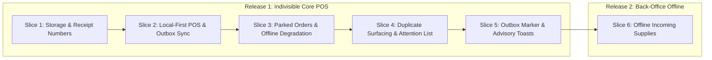

# Proposal: Leyble Hub V2.5 — Offline Accessibility & Local-First POS

**Status:** Settled (Grill completed 2026-08-23). Ready for slice-by-slice implementation.  
**Origin:** Alvin & Firstmate (2026-08-23).  
**Target Hardware:** **Honor Pad X8B** (11.0" Android Tablet, landscape orientation, Station 1) and secondary Android phone/tablet (Station 2).  
**Target Users:** Store owners in Antipolo, Rizal, Philippines (late 50s).  
**See also:** [PRD.md](../PRD.md), [ARCHITECTURE.md](../../architecture/ARCHITECTURE.md), [DATABASE.md](../../architecture/DATABASE.md), [glossary.md](../glossary.md), [v2-tablet-pos-overhaul.md](v2-tablet-pos-overhaul.md), [ADR 0003](../../adr/0003-device-issued-receipt-numbers.md), [ADR 0004](../../adr/0004-local-first-pos.md), [ADR 0005](../../adr/0005-offline-scope-by-operation.md).

---

## 1. Executive Summary & Operating Reality

### Operating Reality in Antipolo
Leyble General Merchandise operates in Antipolo, Philippines, where the physical store faces infrastructure realities that dictate software requirements:

1. **Frequent Network Outages:** Internet connectivity drops roughly **weekly**, for a random duration ranging from **hours to days at worst**.
2. **Current Failure Mode:** Leyble Hub V1 and V2.0 are entirely cloud-dependent. When an outage occurs, the app becomes unusable. Store owners currently fall back to a physical, pre-numbered paper receipt booklet.
3. **Prevalence of Hand-Written Paper Receipts:** Even during normal online operations, **approximately 25% of daily transactions are hand-written on paper** and never entered into Leyble Hub. Physical booklet numbering operates independently and will not collide with app receipt numbering (accepted by the product owner).
4. **Stock Accuracy is Approximate by Design:** Because ~25% of sales bypass the app entirely on paper, inventory stock figures in the database are already approximate by business reality. Therefore, offline software must **never introduce complex blocking machinery to defend theoretical stock precision** (e.g. no offline stock locking, no negative-stock transaction blocks).
5. **Two Concurrent Devices:** The store uses two devices to create sales: the primary counter tablet (**Honor Pad X8B**) and a secondary tablet/phone. Simultaneous order creation across both devices is possible.
6. **Authentication Token Persistence:** The JWT authentication token has **no expiry set in code** (`JWT_EXPIRES_IN` remains unset). Consequently, multi-day outages do not log devices out. *(Constraint: `JWT_EXPIRES_IN` must remain unset in production, or the offline architecture must explicitly handle token expiration).*

### Core Objective
Transform Leyble Hub POS into a **local-first system** where counter operations (creating orders, quick-creating customers, capturing custom prices, and printing thermal receipts) operate with 100% speed and reliability in all network states: online, offline, or experiencing high-latency network timeouts.

```mermaid
graph TD
    subgraph Counter POS Workflow (Local-First Always)
        A[Create Order / Quick Customer] --> B[Save Order Locally in IndexedDB]
        B --> C[Assign Device Receipt Number e.g. 1-00042]
        C --> D[Print 80mm 2-Copy Thermal Receipt Instantly]
        B --> E[Enqueue Record in Local Outbox]
    end

    subgraph Background Sync Worker
        E --> F{Network Available?}
        F -- Yes --> G[Drain Outbox via FIFO Dependency Order]
        G --> H[Cloud API: POST /api/v1/orders]
        H --> I[PostgreSQL on Supabase]
        F -- No --> J[Keep in Outbox: Show Marker 'Offline · N waiting']
        H -- Rejected / Conflict --> K[Move to 'Needs Attention' Queue]
    end
```

---

## 2. Locked Business Rules & Architecture (D1 – D12)

### D1 — Receipt Number is Decoupled from the Database Row ID [SETTLED]
* **Per-Device Station Number Spaces:** `receipt_number` becomes a first-class domain concept issued locally by the device at the moment of Save, executing the exact same code path online and offline.
* **Format:** `<station>-<sequence>`, e.g., `1-00042`, `2-00042`.
* **Row ID Stays Internal:** PostgreSQL `orders.id` integer primary key remains an internal database identifier. The user interface, order history, and thermal receipts display `receipt_number` everywhere `#<id>` was previously shown.
* **One-Time Station Registration:** A device registers with the cloud server once upon initial app installation (`POST /api/v1/stations/register`), receives the next sequential station number (1, 2, ...), and permanently stores it in native storage (`@capacitor/preferences`). Scales to N devices.
* **Station Numbering Invariant:** A wiped or reinstalled device receives a NEW station number upon re-registration, never reclaiming its old station number. Station numbers only creep upward.
* **Existing Orders Backlog:** Approximately 1,300 pre-existing orders retain their plain numeric sequence IDs without a station prefix. This one-time step in numbering is accepted.
* **Offline Installation Edge Case:** A brand-new device installed during an active outage cannot issue receipts until it connects to the internet once to register. Store paper receipt booklets cover this corner case.
* **See also:** [ADR 0003](../../adr/0003-device-issued-receipt-numbers.md).

### D2 — The POS is Local-First, Always [SETTLED]
* **Local-First in Every Case:** Every order creation, customer quick-create, and price capture writes immediately to local client storage (IndexedDB) before touching the network.
* **Offline is an Outbox, Not a Mode:** Offline is not a separate application toggle or fallback code path — it is simply an outbox that has not yet drained.
* **Single Code Path:** Online and offline transactions run the exact same code path every day. This eliminates untested "outage-only" fallback branches and avoids the ambiguity of degraded, hanging network connections.
* **See also:** [ADR 0004](../../adr/0004-local-first-pos.md).

### D3 — Offline Scope is Decided by OPERATION, Not by Module [SETTLED]
Scope is determined strictly by the mathematical nature of the operation rather than UI module boundaries:

| Category | Operations | Handling |
| :--- | :--- | :--- |
| **Works Offline**<br>*(Additive Creates of Self-Contained Records)* | • Build, save, and print POS receipt (`POST /orders`)<br>• Quick-create customer mid-order (`POST /customers`)<br>• Capture customer custom price (`POST /customers/:id/prices`)<br>• Record incoming supplier delivery (`POST /incoming`)<br>• Park an order draft<br>• Reprint receipts from local 30-day cache | Allowed offline. Records are saved locally in IndexedDB and queued in the outbox. Concurrent entries across devices merge cleanly upon sync. |
| **Requires Online Connection**<br>*(Reversals & Overwrites of Shared State)* | • Cancelling a synced order (restores stock)<br>• Voiding a supplier delivery (reverses restock)<br>• Editing an order or delivery that has already synced<br>• Manual stock adjustments and batch price edits | Blocked offline with an explicit online-required message. *(Note: Unsynced local drafts or outbox orders that have not yet left the device may be freely edited or discarded locally).* |

* **See also:** [ADR 0005](../../adr/0005-offline-scope-by-operation.md).

### D4 — Duplicates Land; They are Surfaced, Never Auto-Merged [SETTLED]
When two disconnected devices create customers with identical or similar names offline, both records land in the database upon reconnection. The system surfaces duplicates using the **4 + 3 + 2 combination** (approved via Lavish review):
1. **Tells Them (4):** One non-blocking toast upon outbox drain completion: *"14 receipts synced · 2 customers may be duplicates"*. Fires once per outage recovery, never repeated.
2. **Waits for Them (3):** A clearable count badge on the Customers navigation tab, using the same design language as the POS Drafts/History badges.
3. **Fixes It (2):** A `"possible duplicate"` chip on the customer row in the Customers directory, opening the existing customer merge flow pre-filled. Uses `customerSearch.js` punctuation-insensitive normalization to identify potential duplicate names.
4. **No Auto-Merging:** The system never automatically merges customer accounts based on name matching, as multiple distinct customers in the community may share identical names.

### D5 — Device Clock is Trusted; Paper is the Truth [SETTLED]
* **Device Timestamp at Sale Time:** The receipt's date and time are generated from the device clock at the exact moment of sale (`created_at` passed explicitly in the payload).
* **Why:** If the server assigned insert time on sync, sales made during a Tuesday outage would be recorded on Thursday upon sync, breaking today-scoped History filters, daily sales reporting, and the NOT PRINTED badge, and causing reprinted receipts to contradict the physical paper in customer hands.
* **Precedent:** Follows the existing codebase precedent where `supplier_deliveries.received_at` is passed explicitly from the client.
* **Zero Clock-Policing:** The system assumes tablet clocks synchronize automatically. If clock drift occurs, it is accepted; no clock-skew detection, warning dialogs, or transaction blocking will be built.
* **Pricing & Ordering Rule:** Prices sync exactly as printed per line (`unit_price` per line is already accepted by the server). Locally created customers are sequenced in the outbox to sync before any orders referencing them.

### D6 — Parked Orders Stay Shared Across Devices with Offline Fallback [SETTLED]
* **Online Behavior (Unchanged):** Parked drafts sync to the cloud server and remain visible and resumable across both devices.
* **Offline Degradation:** During an outage, parked orders degrade quietly to device-local storage. A parked draft created offline stays on that tablet until the connection returns.
* **Accepted Double-Print Risk:** Tablet A parks an order → Tablet B picks it up online and prints it → connection drops while Tablet A still holds its stale local draft → Tablet A resumes and prints it offline. The customer receives two receipts with two distinct receipt numbers.
* **Handling:** No distributed locks or blocking guards are built. When connectivity restores and both orders sync, the system flags the matching items as a potential double order using the D4 duplicate surfacing pattern.

### D7 — Outbox Status Marker: Shown Only When There is Something to Say [SETTLED]
* **Subtle Top-Bar Marker:** A status badge appears in the top navigation bar **only** when the device is offline or when receipts are waiting to sync (e.g. `"Offline · 12 waiting"` or `"12 waiting"`).
* **Zero Normal Wallpaper:** When the device is online and the outbox is completely empty, no indicator or green light is shown.
* **Accidental Loss Prevention:** Making the waiting outbox count visible ensures operators do not clear app data, drop, or wipe a device that holds unsynced sales.

```
[ Normal Online / Idle ]  ──►  (No status marker shown in top bar)
[ Outage Active        ]  ──►  [ ⚠️ Offline · 14 waiting ]
[ Online Syncing       ]  ──►  [ 🔄 14 waiting ]  ──►  (Disappears when drained)
```

### D8 — Refused Receipts Go to an Attention List, Never a Guess [SETTLED]
* **Attention List Queue:** If the cloud server rejects an outbox receipt during sync (e.g. because a referenced customer was merged or deactivated on another device during the outage), the receipt is **never discarded** and **never auto-reassigned**.
* **Operator Resolution:** The receipt is moved to a "Needs Attention" queue with a plain-language explanation (e.g., *"Customer Aling Nena was merged into Nena Santos — select destination customer"*). The store owner points the receipt to the correct record in two taps.
* **Rationale:** The physical receipt is already in the customer's hands; silent dropping or guessing customer identity corrupts financial and operational truth.

### D9 — 30-Day Rolling Local History Cache [SETTLED]
* Each device maintains a rolling 30-day cache of past receipts and catalogue records in local IndexedDB storage.
* The local cache is silently updated in the background whenever the device is online, enabling instant search and receipt reprinting during outages without bloating storage.

### D10 — Zero Rehearsal for Store Owners [SETTLED]
* **No User Outage Drills:** Store owners (in their late 50s) will not be asked to rehearse or execute outage drills.
* **Build-Side Verification:** All offline testing, outbox drain verification, and conflict recovery are validated build-side prior to release.
* **Internal Test Toggle:** A simulated offline mode toggle is included strictly as a developer/QA testing tool and is never exposed in the user-facing store interface.

### D11 — Active Disconnect Advisory Toast [SETTLED]
* **Trigger:** When a user actively saves an order and the network call fails for the first time during an outage, a one-time advisory toast notification appears based on registered station number:
  * **Station 1 (Main Counter Tablet / Honor Pad X8B):** *"You are offline. Keep working here, and leave the other device alone until the connection returns."*
  * **Station 2 (Secondary Tablet / Phone):** *"You are offline. Use the main tablet if you can."*
* **Advice, Not a Lockout:** The second device is **not locked out** from creating orders offline. If the main tablet runs out of battery, is on a delivery truck, or is in use, the second device remains fully capable of completing sales.

### D12 — Two-Release Delivery Shape [SETTLED]
The implementation is partitioned into two distinct releases:
1. **Release 1 (Indivisible Core POS):** Local-first POS, device-issued receipt numbers, waiting receipts outbox sync engine, shared-to-local parked drafts, duplicate surfacing, attention list, top-bar status marker, and advisory toasts.
   * *Rationale:* These components form an indivisible core. An offline POS without unique receipt numbers or draft reliability is worse than the current app.
2. **Release 2 (Offline Incoming Supplies):** Offline recording of incoming supplier deliveries (`POST /api/v1/incoming`). Follows immediately after Release 1.

---

## 3. Explicit Non-Goals

To maintain design integrity and prevent over-engineering, the following items are explicitly out of scope:

1. **Defending Stock Accuracy Offline:** No offline stock reservations, warning dialogs for zero/negative stock, or stock locking mechanisms.
2. **Clock-Skew Policing:** No NTP synchronization checks, clock-drift warning modals, or transaction blocking based on device timestamps.
3. **Automatic Duplicate Merging:** No automatic merging of customer profiles based on name similarity.
4. **Distributed Database Engine / CRDTs:** No multi-master distributed consensus protocol.
5. **Hard Station Lockouts:** No hard software barrier preventing Station 2 from creating orders while offline.
6. **User Outage Drills:** No operational rehearsal requirements for store owners.
7. **Dual-Path POS Branches:** No separate "offline mode" UI or distinct fallback execution path.
8. **Server-Issued Number Pre-Allocation:** No server-allocated sequential receipt number blocks.

---

## 4. Implementation Slices & Architecture

### Roadmap & Slices



| Slice | Scope Summary |
| :--- | :--- |
| **V2.5 Slice 1 (Release 1)** | **Indivisible Core POS & Offline Infrastructure:**<br>• Local IndexedDB store (`leyble_local_db`) and station registration (`POST /api/v1/stations/register`)<br>• Device-issued receipt numbers (`<station>-<sequence>`) and display migration<br>• Local-first POS order creation and instant thermal receipt printing<br>• FIFO outbox background sync worker with customer-first dependency ordering<br>• Shared parked orders with quiet offline degradation<br>• Duplicate surfacing (4+3+2 toast, nav badge, row chip) and merge link<br>• Refused receipt "Needs Attention" queue and reassignment UI<br>• Top-bar status marker (`Offline · N waiting`) and active disconnect advisory toasts |
| **V2.5 Slice 2 (Release 2)** | **Offline Incoming Supplies:**<br>• Offline recording of supplier delivery receipts (`POST /api/v1/incoming`)<br>• Local caching of supplier and catalogue baselines<br>• Outbox integration for incoming delivery records |

---

## 5. Technical Design & Data Flow

### Local Storage Schema (`IndexedDB`)
The client leverages a durable IndexedDB database (`leyble_local_db`) containing the following object stores:

```
leyble_local_db
├── station_metadata      # station_number, last_sequence, registered_at
├── outbox_queue          # id, entity_type, payload, status, created_at, retry_count, error
├── orders_cache          # 30-day rolling orders cache keyed by receipt_number
├── drafts_cache          # local & synced parked order drafts
├── customers_cache       # customer directory with custom price maps
├── products_cache        # active products catalogue & wholesale pricing
└── attention_queue       # rejected outbox items requiring operator resolution
```

### Outbox Sync Engine Protocol
1. **Queue Insertion:** When an order or customer is saved, it is written to `outbox_queue` with status `'queued'` and assigned a client UUID.
2. **Dependency Sequencing:** The outbox worker drains records in strict FIFO order respecting entity dependencies:
   Customer Quick-Create → Custom Price Overrides → Order Creation
3. **Execution:**
   - Worker attempts `POST /api/v1/orders` passing client-generated `receipt_number` and `created_at`.
   - On `201 Created`: Record status flips to `'synced'`, local cache updates, and item is pruned from outbox.
   - On Network Error (e.g. `TypeError: Failed to fetch`, timeout): Record remains `'queued'`; worker backs off exponentially.
   - On `4xx Client Error` (e.g. customer deactivated/merged): Record moves to `'needs_attention'` with server error details.

---

## 6. Execution & Verification Protocol

* **Automated Test Coverage:**
  * Local receipt number generation and sequence incrementing under concurrent calls.
  * Outbox queue dependency ordering (ensuring new customer IDs map correctly to pending orders).
  * Duplicate customer detection and normalization logic.
  * Attention list routing upon simulated 400/409 server rejections.
* **Build-Side Verification:**
  * Tested on Android Honor Pad X8B tablet and mobile viewports.
  * Verified using internal developer offline simulation switch to validate zero-latency printing and seamless reconnect draining.
