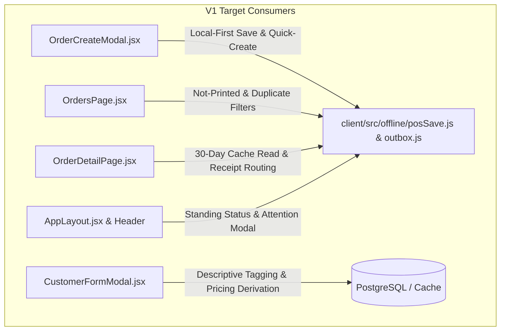

# Leyble Hub V3.0 — POS-Style Order Creation inside V1

**Status:** Shipped — `/v2/*` routes are gone from `client/src/App.jsx` and `POSProductGrid` is imported and rendered inside `OrderCreateModal.jsx` on `staging`.  
**Date:** 2026-08-25  
**Origin:** User feedback on V2.5 demo & Product Owner Grill Outcomes (G1–G17)  
**See also:** [V2.0 Proposal](v2-tablet-pos-overhaul.md), [V2.5 Offline Accessibility](v2-5-offline-accessibility.md), [Glossary](../glossary.md), [Database Reference](../../architecture/DATABASE.md), [ADR Index](../../adr/)

---

## 1. Executive Summary & Why V3.0 Exists

When Leyble Hub V2.5 was demonstrated to the primary store owners in Antipolo (business operators in their late 50s), their feedback was clear and definitive:

1. **Disliked:** The excessive scope of user interface change. V2.0 replaced the familiar application layout with a dark, three-screen tablet shell (`/v2/pos`, `/v2/inventory`, `/v2/customers`) and obscured the back-office administrative modules into a secondary drawer. The owners found this degree of visual and structural change disorienting.
2. **Liked:** The POS-style order creation workflow — specifically, tapping large product category tiles to add items rapidly to an order instead of searching and selecting products line-by-line via combobox dropdowns.

**The Premise of V3.0:**  
Leyble Hub V3.0 retains **V1 as the core application** and adopts **only** the fast POS tile-picking interaction pattern, embedding it directly inside V1's existing `Outgoing Orders → Create Order → New Order` modal ([`OrderCreateModal.jsx`](../../../client/src/pages/orders/OrderCreateModal.jsx)). The standalone V2.0 three-screen shell and `/v2/*` routes are removed entirely. Concurrently, the offline resilience and local-first architecture designed in V2.5 ([`v2-5-offline-accessibility.md`](v2-5-offline-accessibility.md)) are fully carried forward and re-hosted onto V1's screens.

### Roadmap Renumbering
- **V3.0** is established as this release: **POS-Style Order Creation inside V1 & Re-Hosted Offline Core**.
- The previously planned **V3.0 Slice 1 (Voice AI / Taglish parsing)** is rescheduled to **V4.0** on the project roadmap (see updates in [`v2-tablet-pos-overhaul.md`](v2-tablet-pos-overhaul.md)).

### Three Standing Principles
1. **V1 is the App:** The proven V1 administrative workflows, order lifecycle (`pending → in_transit → completed → done`), Review Deliveries queues, and module navigations are preserved without structural disruption.
2. **Minimum Visual Change from V1:** Every borrowed element from V2/V2.5 must strictly justify itself against the users' change-fatigue budget.
3. **V2.5's Offline Core is Carried Forward:** The offline outbox, local-first save, device-issued receipt numbering, 30-day rolling history, and duplicate detection are preserved in full, re-attached cleanly to V1 components.

---

## 2. Screenshot Markup: What is Adopted vs. Dropped

The V3.0 scope is directly derived from the product owner's item-by-item markup of the running V2.5 interface across three panels:

### Panel 1 — POS Screen & Top Bar

| Mark # | Element | Decision | Rationale & Scope |
| :--- | :--- | :--- | :--- |
| **1** | Red dot beside "Leyble Hub" wordmark | **Adopt** | Subtle brand visual accent; placed left of the header wordmark. |
| **2** | `POS` top nav tab | **Drop** | No separate POS top-level screen exists. Order creation lives inside V1's Outgoing Orders modal. |
| **3** | `Inventory` top nav tab | **Drop** | V1 Inventory is retained. Inline price editing is deferred to a post-V3.0 follow-up (V3-D14). |
| **4** | `Customers` top nav tab | **Drop** | V1 Customers directory is retained. |
| **6** | `● Offline · N waiting` status pill | **Adopt** | Standing connection marker re-hosted into V1's application chrome (V3-D7, V3-D8). |
| **7** | `Printer` top bar button | **Drop** | V1 already has [`PrinterPicker.jsx`](../../../client/src/pages/orders/PrinterPicker.jsx); no extra function needed. |
| **8** | `💡 Light` / Dark toggle | **Adopt (Scoped)** | Scoped strictly to the Outgoing Orders module and New Order modal (V3-D13). Defaults to Light. |
| **9–11** | Profile name, Switch profile, Log out | **Keep (V1)** | Already present in V1 header/sidebar. No action needed. |

### Panel 1 — Product Panel (Left) & Order Panel (Right)
*Marks 15 and 16 were space-filling annotations across the product grid; the functional product-panel scope consists of five distinct marks: 12, 13, 14, 17, and 18.*

| Mark # | Element | Decision | Rationale & Scope |
| :--- | :--- | :--- | :--- |
| **12** | Product Search + Category Pill Matrix | **Adopt** | Search input combined with multi-row category filter pills for rapid inventory filtering. |
| **13** | `📄 Drafts` & `🕐 History` quick access buttons | **Adopt** | Quick-access triggers on the order creation surface to view parked drafts and order history. |
| **14** | Product Card Tile Grid (incl. 15, 16) | **Adopt** | High-contrast touch tiles displaying SKU, product name, category, and price per case. Tapping increments item quantity. |
| **17** | Customer Picker & Delivery/Pickup Toggle | **Adopt** | Clean order header with customer selection, inline quick-create, and order type switch. |
| **18** | Order Line List, Adjustment, Notes, Totals | **Adopt** | Line items with 0.5-case quantity steppers, manual adjustment input, optional notes, and running goods totals. |

### Panel 1 — Order Panel Action Row

| Mark # | Element | Decision | Rationale & Scope |
| :--- | :--- | :--- | :--- |
| **19** | `Draft` button | **Keep (V1)** | V1's automatic draft debouncing is preserved without adding extra manual draft modals. |
| **20** | `💾 SAVE ORDER` action | **Adopt (V1 Shape)** | Drops V2's Save → Print buffer, saved-mode panel, and Amber Edit Mode. Saving writes local-first and lands directly on `/orders/<receipt-number>` (V3-D5). |
| **21** | `🛒 Clear Order` button | **Adopt as Reset** | Implemented as a **Reset** button. Clears basket lines, adjustment, and notes, but preserves the selected customer and active draft (V3-D9). |

### Panel 2 — Drafts Modal

| Mark # | Element | Decision | Rationale & Scope |
| :--- | :--- | :--- | :--- |
| **22** | Drafts Modal Search & Bulk Discard | **Adopt Additions** | V1 already has parked drafts with click-to-resume and per-row discard. V3.0 adds a scoped **search box** and a **"Discard all N drafts"** bulk action (V3-D17). |

### Panel 3 — Order History Modal

| Mark # | Element | Decision | Rationale & Scope |
| :--- | :--- | :--- | :--- |
| **23** | `⚠️ Not printed only` filter | **Adopt into V1** | Added as a quick filter on V1's Outgoing Orders table to identify unprinted receipts. |
| **24** | `⚠️ Possible double only` filter | **Adopt into V1** | Added as a filter on V1's Outgoing Orders table to surface concurrent offline duplicate orders (V3-D18). |

---

## 3. Settled Decisions (V3-D1–V3-D18)

### V3-D1 — Single Unified Release: POS Tile Modal & Re-Hosted Offline Core [SETTLED]
* **Decision:** V3.0 ships both the POS tile order creation modal and the complete re-hosted offline core together in one release.
* **Rationale:**
  1. The offline status marker (mark 6) and "Possible double" filter (mark 24) are the user-facing skin of the offline outbox and duplicate detection engines (V2.5 D4, D6, D7). They cannot function without the outbox machinery running.
  2. Local-first save ([ADR 0004](../../adr/0004-local-first-pos.md) / V2.5 D2) is designed as a single code path. Building the tile modal on the old online `POST /orders` endpoint only to rewrite it for offline in V3.1 would require performing high-risk surgery twice on the primary selling screen.
  3. The offline core is low-visual-churn by design; it does not burden the users' visual change threshold.
* **Accepted Cost:** The deployment introduces both a new order-building UI and a new storage/sync engine simultaneously. A day-one receipt fault will require investigating both UI state and storage/drain pipelines.

### V3-D2 — Tablets Only are Stations; Desktop Browser is a Persistent Dev Tier [SETTLED]
* **Decision:** Physical Android tablets are the only production stations. The desktop browser is strictly a development and administration testing tier and does not mint ephemeral production station numbers.
* **Rationale:** In V2.5, non-native environments fell back to an in-memory `Map` that generated a fresh `crypto.randomUUID()` on every page reload, causing `POST /api/v1/stations/register` to allocate and permanently burn incremental station IDs (e.g. 7, 8, 9...) on dev databases (V2.5 D1, D17). Providing a persistent `localStorage` dev backend allows the browser to register once, persist its station ID, and realistically test outbox persistence across page reloads.
* **Accepted Cost:** Dev environments require explicit identification (`label: "dev — <hostname>"` sent during registration) to distinguish dev stations from live physical store tablets.
* **See also:** [ADR 0011](../../adr/0011-tablets-as-stations-browser-as-dev-tier.md).

### V3-D3 — Stock Deduction Reverts to V1's Deduct-on-Dispatch [SETTLED, PROVISIONAL]
* **Decision:** Order stock deduction reverts from V2's deduct-on-save back to V1's deduct-on-dispatch (`in_transit` for delivery, `completed` for pickup in [`server/src/routes/orders.js`](../../../server/src/routes/orders.js)).
* **Rationale:**
  1. V2 moved stock deduction to creation because it silenced the Review Deliveries queue and treated every order as an immediate retail checkout. V3.0 restores V1's full order lifecycle and batch-review queues.
  2. Deduct-on-save makes inventory levels an offline-affected quantity: an order saved offline at 2:00 PM during an outage and synced at 5:00 PM would deduct stock 3 hours late, causing discrepancies between order creation time and inventory audit logs. Under deduct-on-dispatch, stock deduction is a status transition that occurs strictly online when goods physically leave the warehouse. This upholds V2.5 Explicit Non-Goal 1 ("No offline stock reservations").
* **Accepted Cost:** Pickups deduct at `completed`. If an operator creates a pickup order but forgets to advance its status to completed, stock remains un-deducted until status reconciliation. Hardening fixes (rejection of negative prices and deposit fees, null `product_id` guards) are retained regardless.
* **See also:** [ADR 0012](../../adr/0012-stock-deducts-at-dispatch-not-at-save.md).

### V3-D4 — Receipt Numbers Displayed Screen-Wide and on Paper [SETTLED]
* **Decision:** Device-issued receipt numbers (`<station>-<sequence>`, e.g., `1-00042`) are displayed across all UI screens, order tables, detail views, and printed thermal receipts wherever a receipt number exists. Pre-V2.5 historical orders without receipt numbers fall back to `#<id>`.
* **Rationale:** When an order is saved local-first while offline (V2.5 D1, D5), it has no PostgreSQL primary key `id` (the row ID is assigned hours later upon outbox drain). The receipt number is the only stable identifier that exists at the moment of sale and physical receipt printing.
* **Accepted Cost:** The Outgoing Orders table will show mixed identifiers (`1-00042` above `#1240`) during the changeover period. Historical records (~1,300 orders) remain `#<id>` permanently.
* **See also:** [ADR 0003](../../adr/0003-device-issued-receipt-numbers.md), [ADR 0010](../../adr/0010-receipt-number-addresses-order-across-sync-boundary.md).

### V3-D5 — Save Lands on `/orders/<receipt-number>` with Local-First Detail [SETTLED]
* **Decision:** Upon saving an order in the New Order modal, the application navigates immediately to `/orders/<receipt-number>`, displaying the order details from local storage or server cache without waiting for outbox sync.
* **Rationale:** V1 navigated to `/orders/<id>` based on the server's return payload. Because local-first saves do not wait for network round-trips, the route must address the order by its stable `receipt_number`. The Express backend already resolves both `:id` and `\d+-\d+` receipt numbers via `resolveOrderId()` in [`server/src/routes/orders.js`](../../../server/src/routes/orders.js).
* **Accepted Cost:** [`OrderDetailPage.jsx`](../../../client/src/pages/orders/OrderDetailPage.jsx) gains a local-first read state to render unsynced orders from the 30-day cache (V2.5 D9), showing a "waiting to sync" indicator with server-dependent mutations (dispatch, cancel) disabled until drained.

### V3-D6 — Bottle Deposit Handled Goods-Only During Creation [SETTLED]
* **Decision:** The New Order modal displays goods-only line totals (`qty × unit_price`) and goods-only grand totals during creation. Pre-close receipts print goods-only, with refundable bottle deposits calculated and folded in only upon order close/delivery review.
* **Rationale:** Verification of code truth confirmed that V1's modal ([`OrderCreateModal.jsx:199-202`](../../../client/src/pages/orders/OrderCreateModal.jsx)) and V2's POS math ([`posMath.js`](../../../client/src/components/pos/posMath.js)) already operate identically: pending receipts assume full bottle return and exclude deposit fees from open totals. V3.0 maintains this exact business rule.
* **Accepted Cost:** None; aligns V1 and V2 data models without divergence.

### V3-D7 — Refused-Receipt Attention List Hosted in Standing Connection Marker [SETTLED]
* **Decision:** The "Needs Attention" modal ([`NeedsAttentionModal.jsx`](../../../client/src/components/pos/NeedsAttentionModal.jsx)) for server-refused outbox receipts (e.g. referencing a deleted product or merged customer) is triggered directly from the standing offline connection marker in the top bar.
* **Rationale:** When the standalone V2 POS screen is dropped, the attention list UI (V2.5 D8) needed a permanent, accessible home. Hosting it inside the top-bar status marker ensures operators are immediately alerted via a red pulsing indicator and can resolve discrepancies in two taps from any screen.
* **Accepted Cost:** Server sync rejections must be resolved via the top-bar modal before the attention badge clears.

### V3-D8 — Always-Visible Connection Marker Across App Chrome [SETTLED]
* **Decision:** The connection status marker ([`OfflineMarker.jsx`](../../../client/src/components/layout/OfflineMarker.jsx)) is permanently visible in V1's tablet top bar and desktop navigation across all application views (Dashboard, Orders, Inventory, Customers, Supplies, Personnel, Tickets, Audit).
* **States:**
  - **Online & Idle (0 waiting):** Calm green `● Online` pill.
  - **Online & Draining:** Sky-blue `● N waiting` pill.
  - **Offline & Idle (0 waiting):** Amber `● Offline` pill.
  - **Offline & Queued:** Amber `● Offline · N waiting` pill.
  - **Refused Records:** Red pulsing `● Needs attention` / `● N waiting` pill (clickable).
* **Rationale:** The standing marker was introduced during implementation on 2026-08-24 (`client/src/components/layout/OfflineMarker.jsx`, whose header records the revision), the written rule in V2.5 proposal §2.7 (D7) was never updated at the time, and the product owner confirmed on 2026-08-25 that the shipped always-visible marker is correct and the specification should follow it. No rationale was recorded for the revision at the time.
* **Accepted Cost:** Restyling the marker from V2's dark theme tokens into V1's slate design palette.

### V3-D9 — Reset Clears Order Lines, Retains Customer and Parked Draft [SETTLED]
* **Decision:** Tapping `Reset` (mark 21) in the New Order modal clears all item lines, adjustments, and notes, while retaining the selected customer, order type, and active auto-saved draft.
* **Rationale:** In a tile-based flow, accidental taps occur on product cards, not customer selection. Reset allows operators to start item entry over without forcing a redundant customer re-search. If lines exist, a single confirmation prompt prevents accidental clears; with 0 lines, reset executes instantly.
* **Accepted Cost:** Parked drafts may temporarily auto-save with zero lines until closed or discarded.

| Action | Item Lines | Customer & Type | Backend Draft Row | Resulting Navigation |
| :--- | :--- | :--- | :--- | :--- |
| **Reset** (New) | Cleared | Retained | Retained (empty) | Remains in New Order modal |
| **Close** (X / Backdrop) | Retained | Retained | Retained (parked) | Returns to Outgoing Orders list |
| **Discard** (Existing) | Cleared | Cleared | Deleted (`DELETE /orders/:id`) | Returns to Outgoing Orders list |

### V3-D10 — Offline Core Ships Switched On Permanently; Release Flag Removed [SETTLED]
* **Decision:** Build-time release flag `VITE_V25_OFFLINE_CORE` (V2.5 D18 / ADR 0008) is removed across all 17 codebase call sites. V3.0 ships the offline local-first engine permanently enabled. Developer test toggle `VITE_V25_SIMULATE_OFFLINE` (V2.5 D10) is retained.
* **Rationale:** Keeping a runtime/build switch after full deployment is hazardous: flipping the switch off on a tablet holding unsynced records would render those queued receipts invisible while still trapped in native device storage.
* **Accepted Cost:** Rollback cannot be performed via a config flag; emergency recovery requires sideloading a prior APK build.
* **See also:** [ADR 0013](../../adr/0013-unswitched-offline-core-no-flag-rollback.md).

### V3-D11 — Salvage Required POS Components, Delete Remainder of V2 [SETTLED]
* **Decision:** Salvage functional UI components required for V3.0 (product tile grid, order panel, steppers, math utilities, offline marker, attention modal), re-host them in V1, and permanently delete the unused V2 shell, screens, and routes.
* **Rationale:** Retaining unreachable V2 screens (`/v2/*`) creates dead code rot and confusion for future maintenance. Clean deletion ensures the production APK bundle remains lean and maintainable.
* **Accepted Cost:** A single large pull request consisting primarily of component deletions and refactoring.

### V3-D12 — Inline Customer Quick-Create Uses Offline Outbox [SETTLED]
* **Decision:** V1's existing customer quick-create input inside the order creation modal is wired to the offline outbox pipeline.
* **Rationale:** V1 already supported inline customer creation ([`OrderCreateModal.jsx:124-135`](../../../client/src/pages/orders/OrderCreateModal.jsx)), but failed when offline. Routing quick-creates through `outbox.js` (V2.5 D3) allows operators to add new customer names during network outages with automatic background synchronization.
* **Accepted Cost:** Offline quick-created customers may trigger duplicate surfacing if created concurrently across multiple disconnected tablets (handled via V2.5 D4).

### V3-D13 — Dark Mode Scoped to Outgoing Orders with Light Default and Redesigned Palette [SETTLED]
* **Decision:** Dark mode support is scoped strictly to the Outgoing Orders module and New Order modal. The app defaults to Light mode, and the dark palette is redesigned fresh using V1's slate color family rather than porting V2's crimson/charcoal theme tokens.
* **Rationale:** Defaulting to Light mode preserves visual familiarity for store owners. Redesigning the palette within Tailwind's standard slate scale avoids importing V2's heavy branding into V1 through the back door.
* **Accepted Cost:** A visual boundary exists between the darkened Outgoing Orders views and other light back-office modules when dark mode is manually toggled on.

### V3-D14 — Inventory Inline Price Edit Deferred to Post-V3.0 Follow-Up [SETTLED]
* **Decision:** Porting inline editable price cells into V1's Inventory table is deferred to a dedicated post-V3.0 release.
* **Rationale:**
  1. Store owners requested POS order creation improvements; they did not request Inventory UI changes.
  2. In an offline-enabled architecture, inline price edits represent shared-state overwrites that must be gated by online connectivity checks ([ADR 0005](../../adr/0005-offline-scope-by-operation.md) / V2.5 D3). Keeping Inventory untouched in V3.0 isolates release risk.
* **Accepted Cost:** Price updates in V3.0 continue to use V1's existing batch price edit modal and product detail panels.

### V3-D15 — Custom Pricing Derived from Saved Prices; `customer_type` is Pure Descriptive Tag [SETTLED]
* **Decision:** Custom pricing eligibility is derived dynamically from whether a customer has records in `customer_product_prices`. The `customer_type` field becomes a purely descriptive categorization tag (`regular`, `wholesaler`, `discounted`, `markup`). The redundant `unassigned` type is collapsed into `regular`.
* **Rationale:** Decouples pricing logic from categorization tags. Previously, regular customers with saved custom prices had their rates silently ignored on orders unless converted to wholesaler status ([ADR 0001](../../adr/0001-wholesaler-status-gates-custom-pricing.md)). Deriving custom pricing directly from the database table eliminates orphaned price data and removes confusing UI labels.
* **Accepted Cost:** The customer management form is updated to remove "— With Custom Prices" suffixes, treating customer types as descriptive labels.
* **See also:** [ADR 0009](../../adr/0009-custom-pricing-derived-from-saved-prices.md).

### V3-D16 — App Lands on Outgoing Orders; V1↔V2 Bridge Removed Entirely [SETTLED]
* **Decision:** The Android APK opens directly on Outgoing Orders (`/orders`). The V1↔V2 3-second long-press switching bridge, `preferred_ui` storage sync, and `/v2/*` routes are removed completely. The `sensorLandscape` orientation lock is retained.
* **Rationale:** Taking orders is the primary daily function of store tablets. Landing directly on Outgoing Orders saves a navigation tap on launch. Because V2 screens are retired, dual-app switching machinery is obsolete.
* **Accepted Cost:** Users accustomed to landing on `/dashboard` transition to starting on `/orders` (Dashboard remains accessible via the sidebar navigation).

### V3-D17 — Drafts Modal Gains Search Box and Bulk Discard-All [SETTLED]
* **Decision:** V1's parked drafts workflow adopts a customer/order search input and a "Discard all N drafts" bulk action.
* **Rationale:** Allows quick cleanup of abandoned drafts accumulated during busy counter operations without modifying V1's underlying draft auto-save engine.
* **Accepted Cost:** Minimal UI expansion on the Drafts management dialog.

### V3-D18 — Outgoing Orders Gains "Not Printed" and "Possible Double" Filters [SETTLED]
* **Decision:** V1's Outgoing Orders table adopts two new status filter pills: "Not printed only" (scoped to today's unprinted pending orders) and "Possible double only" (surfacing concurrent offline draft prints per V2.5 D4, D6).
* **Rationale:** Provides high-visibility filtering for daily fulfillment and offline duplicate reconciliation directly within the main orders list.
* **Accepted Cost:** Minor addition of filter chips to the Outgoing Orders table header.

### V3-D19 — Two-Stage Release Sequencing: Database Migrations Ahead of Server & APK [SETTLED]
* **Decision:** Database migrations deploy first and alone ahead of release day; the server and the Android APK land together on release day.
* **Rationale:**
  1. The hosted API redeploys automatically from `main` on Render (`render.yaml:18`, production environment, `branch: main`). Live store tablets call this hosted API. Anything merged to `main` reaches the live store within minutes, with no APK update and nothing for the owners to install.
  2. The Render build command (`render.yaml:23-24`) executes `npm --prefix server install && node server/db/migrate.js`, so merging to `main` also applies pending migrations to the production database automatically on deploy without a pause step.
  3. Migrations `031`, `032`, and `033` have never been applied to production (verified against the live database on 2026-08-25; `_migrations` stops at `030`). All three migrations are strictly additive: `031`/`032` widen the customer type check constraint, and `033` creates the `stations` table and adds nullable columns / partial unique index to `orders`. None drop, rename, or retype schema objects. Running them early introduces zero disruption for the running V1 server.
  4. Two critical V3.0 changes are invisible on screen: saved prices becoming the pricing source (G16 / ADR 0009 / V3-D15) and stock deduction returning to dispatch time (G4 / ADR 0012 / V3-D3). If either reached `main` before the APK update, the store tablets' prices and stock behavior would change while the app looked identical to operators.
* **Accepted Cost:** Deploying the release requires a two-stage operational procedure rather than a single git merge to `main`.
* **See also:** [ADR 0014](../../adr/0014-v3-release-sequencing.md).

---

## 4. Re-Hosting the Offline Core: Consumer Map

The generic offline engine (`client/src/offline/`: native store, outbox queue, station registration, 30-day cache, duplicate detection) is re-attached from retired V2 screens to V1 components:

| V2.5 Consumer (Retired) | V1 Host Component | Implementation Responsibility |
| :--- | :--- | :--- |
| `pages/pos/POSPage.jsx` | [`pages/orders/OrderCreateModal.jsx`](../../../client/src/pages/orders/OrderCreateModal.jsx) | Executes `saveOrderLocalFirst()`, handles category matrix, tile picking, and steppers. |
| `components/pos/POSCustomerSearch.jsx` | [`pages/orders/OrderCreateModal.jsx`](../../../client/src/pages/orders/OrderCreateModal.jsx) | Customer picker with offline-capable inline quick-create queued via outbox. |
| `components/pos/POSDraftsModal.jsx` | [`pages/orders/OrdersPage.jsx`](../../../client/src/pages/orders/OrdersPage.jsx) | Drafts modal with added search box and bulk discard-all action. |
| `components/pos/POSHistoryModal.jsx` | [`pages/orders/OrdersPage.jsx`](../../../client/src/pages/orders/OrdersPage.jsx) | Outgoing Orders table enhanced with "Not printed" and "Possible double" filter chips. |
| `components/pos/NeedsAttentionModal.jsx` | [`components/layout/OfflineMarker.jsx`](../../../client/src/components/layout/OfflineMarker.jsx) | Triggered via red attention badge in top bar for resolving server-refused outbox receipts. |
| `components/layout/V2Shell.jsx` | [`components/layout/AppLayout.jsx`](../../../client/src/components/layout/AppLayout.jsx) | Hosts standing `OfflineMarker`, drain toasts, and Outgoing Orders dark theme provider. |
| `pages/orders/usePrintReceipt.js` | [`pages/orders/usePrintReceipt.js`](../../../client/src/pages/orders/usePrintReceipt.js) | Shared ESC/POS thermal printing with device-issued receipt numbers. |
| `pages/LoginPage.jsx` | [`pages/LoginPage.jsx`](../../../client/src/pages/LoginPage.jsx) | Preserved offline notice when outbox holds unsynced records across sessions. |

---

## 5. Component Disposition: What Survives vs. Deleted

| Component / File | Disposition | Destination / Action |
| :--- | :--- | :--- |
| `components/pos/POSProductGrid.jsx` | **Survives** | Moved into V1 order modal (`components/orders/POSProductGrid.jsx`). |
| `components/pos/POSOrderPanel.jsx` | **Survives** | Refactored into V1 New Order modal right panel. |
| `components/pos/CaseStepper.jsx` | **Survives** | Shared stepper component for order lines and cards. |
| `components/pos/posMath.js` | **Survives** | Shared goods-only line and order calculation engine. |
| `components/layout/OfflineMarker.jsx` | **Survives** | Restyled and mounted into `AppLayout.jsx` top bar / desktop navigation. |
| `components/pos/NeedsAttentionModal.jsx` | **Survives** | Mounted inside `OfflineMarker.jsx` for sync conflict resolution. |
| `utils/orderRef.js` | **Survives** | Standard order display helper (switch check removed, permanently active). |
| `client/src/offline/*` | **Survives** | Full generic local-first offline core (outbox, store, drain, sync). |
| `components/layout/V2Shell.jsx` | **Deleted** | Dropped with V2 navigation shell. |
| `pages/pos/POSPage.jsx` | **Deleted** | Dropped; replaced by V1 New Order modal. |
| `pages/inventory/InventoryV2Page.jsx` | **Deleted** | Dropped; V1 Inventory retained. |
| `pages/customers/CustomersV2Page.jsx` | **Deleted** | Dropped; V1 Customers retained. |
| `components/pos/POSReviewModal.jsx` | **Deleted** | Dropped; save lands on `/orders/<receipt-number>`. |
| `components/pos/AmberEditHeader.jsx` | **Deleted** | Dropped with V2 Amber Edit Mode. |
| `components/pos/POSConfirm.jsx` | **Deleted** | Dropped with V2 review flow. |
| `components/pos/POSListModal.jsx` | **Deleted** | Dropped; replaced by V1 native dialogs. |
| `components/pos/OrderViewModal.jsx` | **Deleted** | Dropped; V1 Order Detail page used instead. |
| `components/pos/POSCustomerSearch.jsx` | **Deleted** | Merged into V1 customer combobox. |
| `Sidebar.jsx` long-press & `/v2/*` | **Deleted** | Dual-app bridge and `/v2/*` routes removed entirely. |

---

## 6. Explicit Non-Goals

1. **No Inline Price Editing in Inventory in V3.0:** Retained as a post-V3.0 follow-up release (V3-D14).
2. **No Full-Application Dark Mode:** Dark mode is strictly localized to Outgoing Orders and the New Order modal (V3-D13).
3. **No Dual-Path Online/Offline Execution:** Online and offline order creation follow the exact same local-first outbox path every day (V3-D1).
4. **No Offline Stock Reservation or Clock Policing:** Inventory stock deducts at online dispatch; device timestamps are trusted without NTP clock blocking (V3-D3).
5. **No Automatic Customer Merging:** Duplicate customer names created offline are surfaced via badges/chips for manual review, never merged automatically (V2.5 D4).
6. **No Runtime Feature Switch Rollback:** The offline core is permanently active; rollback is by APK reinstallation (V3-D10).

---

## 7. Live Production Database Verification & Findings (2026-08-25)

The production Supabase PostgreSQL instance was audited on 2026-08-25 via direct read-only query access (`supabase-leyble`). The findings settled prior inferences and clarified the data landscape:

### 1. Production Migration Status: Confirmed
- `SELECT filename FROM _migrations ORDER BY filename;` returned 29 applied migrations (`001` through `030`, with `021` absent as it was never created).
- Migrations `031`, `032`, and `033` have **never been applied to production**.
- Because all three migrations are strictly additive (widening check constraints and adding nullable columns/tables), they can be applied early and alone ahead of release day without interrupting the running V1 server ([ADR 0014](../../adr/0014-v3-release-sequencing.md)).

### 2. Live Customer Tags & Saved Prices Distribution
The customer distribution query revealed that V2 exploratory customer tagging on local dev wrote through to the live production database (prior to establishing the separate development database):

| `customer_type` | Total Customers | Customers with Saved Prices | Total Saved Price Rows |
| :--- | ---: | ---: | ---: |
| `regular` | 322 | 4 | 9 |
| `wholesaler` | 103 | 103 | 800 |
| `discounted` | 27 | 27 | 217 |
| `markup` | 8 | 8 | 13 |

- No `unassigned` customer rows exist in production, so collapsing `unassigned` to `regular` is a clean no-op.
- **35 live customers** carry `discounted` (27) or `markup` (8) tags, representing 230 saved price rows. Because V1 only loaded custom prices when `customer_type === 'wholesaler'` (`OrderCreateModal.jsx:104-105`), these 230 agreed prices were previously dead in the V1 order creation UI.

### 3. Price-Audit Finding Corrected: Audit is NOT a Prerequisite
- **Initial Belief:** A preliminary scan flagged seven out-of-band price rows in `customer_product_prices` with values roughly 94x–99x higher than base wholesale prices (e.g., ₱73,200 for a ₱736 item), leading to the belief that a full price audit and database cleanup was a mandatory prerequisite before activating G16 to prevent catastrophic billing errors.
- **Evidence & Code Truth:**
  1. `customer_product_prices` is strictly **append-only**. Every price update inserts a new row via `POST /api/v1/customers/:id/prices`; no in-place `UPDATE` or `DELETE` exists.
  2. The read path (`server/src/routes/customers.js`, `GET /customers/:id/prices` via `SELECT DISTINCT ON (cpp.product_id) ... ORDER BY cpp.product_id, cpp.created_at DESC`) returns **only the most recent row per customer, product, and order type**. Both the customer profile panel and the order creation modal consume this exact query.
  3. All seven out-of-band rows were superseded by subsequent corrected rows (centavo-style entry slips, e.g. typing 73200 instead of 732.00, corrected to 732.00). Five of the seven were superseded within two minutes of the original entry.
  4. These out-of-band rows are historical log entries that are never returned by the read path and can never reach an active order.
- **Conclusion:** No price clean-up is owed in the database, and the price audit is **not** a prerequisite of the G16 pricing change.

### 4. What G16 Actually Changes for Live Customers
Under G16, custom pricing follows saved prices in `customer_product_prices`, and `customer_type` becomes a purely descriptive tag. On release day, agreed custom prices begin applying automatically for these accounts:

| Tag | Customers | Current saved prices | Effect against base price |
| :--- | ---: | ---: | :--- |
| `discounted` | 27 | 195 | 193 below base; average ₱5.51 lower per case, largest ₱20 |
| `markup` | 8 | 13 | 12 above base; average ₱2.92 higher per case, largest ₱5 |
| `regular` | 4 | 6 | mostly equal to base; one ₱40 below |

- **Correction vs. New Policy:** This is a correction rather than a new pricing policy. In V1, operators had to remember and manually type these negotiated prices in at order time, leading to inconsistent charges across orders. Sampled historical orders showed one customer charged base price when a lower agreed price existed ("Cagayan Rice" charged ₱200 vs agreed ₱190 for `Y-COB-PET`), and markup accounts charged below agreed prices ("FALLEN ANGEL" and "Berdan" charged base ₱1,065 vs agreed ₱1,070 for `SML`). G16 makes the already-agreed price apply consistently.
- **Operational Consequence:** The affected customers' order totals will visibly change on release day to reflect their agreed prices consistently. The store owners should be informed of this pricing transition prior to release day rather than after.

